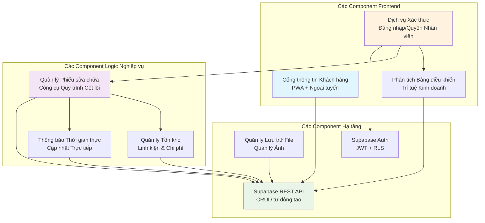
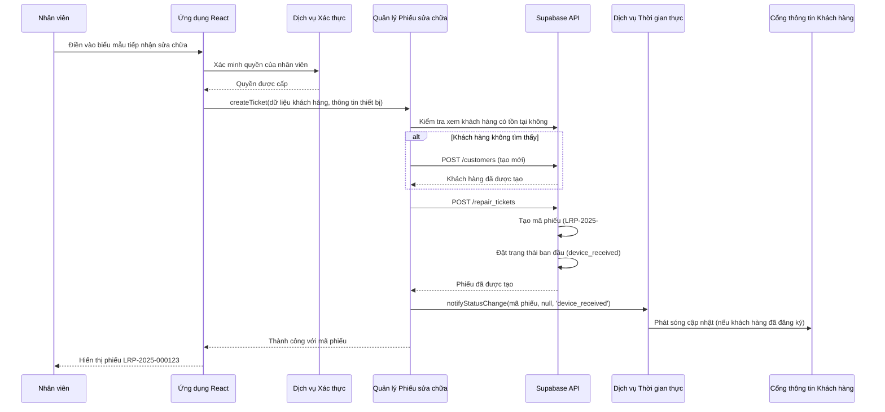
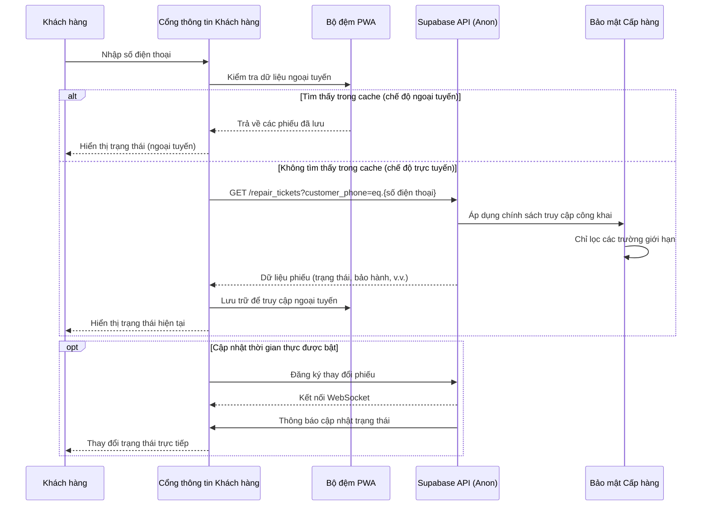
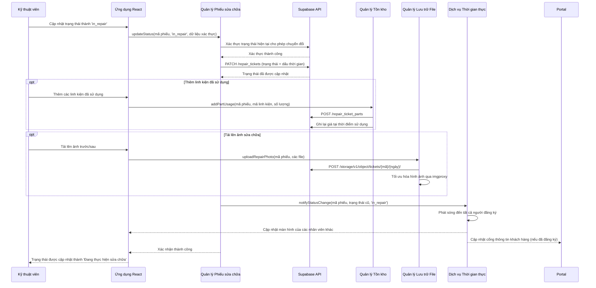

# Tài liệu Kiến trúc Fullstack cho Hệ thống Quản lý Sửa chữa Laptop

## Giới thiệu

Tài liệu này mô tả kiến trúc fullstack hoàn chỉnh cho **Hệ thống Quản lý Sửa chữa Laptop**, bao gồm hệ thống backend, triển khai frontend và sự tích hợp giữa chúng. Nó đóng vai trò là nguồn thông tin chính xác duy nhất (single source of truth) cho việc phát triển do AI điều khiển, đảm bảo tính nhất quán trên toàn bộ chồng công nghệ (technology stack).

Cách tiếp cận hợp nhất này kết hợp những gì thường là các tài liệu kiến trúc backend và frontend riêng biệt, giúp tinh giản quy trình phát triển cho các ứng dụng fullstack hiện đại, nơi các mối quanâm này ngày càng liên kết chặt chẽ.

Hệ thống này phục vụ một cửa hàng sửa chữa laptop nhỏ (<10 nhân viên) đang chuyển đổi từ WordPress sang một nền tảng quản lý toàn diện, xử lý các quy trình sửa chữa (repair workflows), quản lý khách hàng, tồn kho linh kiện và tra cứu phiếu sửa chữa công khai.

### Phân tích Template Khởi đầu (Starter Template Analysis)

**Đánh giá Template:** Dự án của bạn sử dụng một **chồng Supabase tự host (self-hosted)** qua Docker thay vì các template khởi đầu tiêu chuẩn. Các ràng buộc kiến trúc chính đã được thiết lập:

- **Backend:** Supabase tự host qua Docker (PostgreSQL, Auth, Storage, Real-time, RLS)
- **Frontend:** Vite + React 19 + TanStack Router + TypeScript
- **Hạ tầng (Infrastructure):** Docker Compose tất cả trong một với **API gateway Kong nội bộ của Supabase**
- **Mô hình Triển khai (Deployment Model):** Một môi trường duy nhất (không tách biệt dev/prod)
- **Thiết lập Môi trường (Environment Setup):** Tiếp cận 3 giai đoạn (make env → make init → make data)

### HIỂU BIẾT QUAN TRỌNG VỀ KIẾN TRÚC KONG

**Kong là API Gateway NỘI BỘ của Supabase** - Kong tổng hợp TẤT CẢ các dịch vụ của Supabase (auth, rest, storage, realtime, functions) thông qua một điểm cuối duy nhất (localhost:8000).

**Luồng kết nối (Connection Flow):**
```
React App → Supabase Client → Kong (localhost:8000) → Các dịch vụ nội bộ Supabase
                                    ├── Dịch vụ Auth (:9999)
                                    ├── PostgREST API (:3000)
                                    ├── Dịch vụ Storage (:5000)
                                    ├── Dịch vụ Realtime (:4000)
                                    └── Edge Functions (:8081)
```

**Chỉ có 3 dịch vụ được tiếp xúc ra bên ngoài:**
- **Cổng 3001:** Ứng dụng React (cho người dùng cuối)
- **Cổng 8000/8443:** Kong/Supabase API (cho ứng dụng React qua Supabase client)
- **Cổng 3010:** Studio (để quản lý cơ sở dữ liệu)

**Ứng dụng React chạy độc lập** và chỉ kết nối đến điểm cuối Kong, không bao giờ kết nối trực tiếp đến từng dịch vụ Supabase riêng lẻ.

### Nhật ký Thay đổi (Change Log)

| Ngày | Phiên bản | Mô tả | Tác giả |
|------|---------|-------------|--------|
| 2025-01-22 | 1.0 | Tài liệu kiến trúc ban đầu | Winston (Architect Agent) |

## Kiến trúc Cấp cao (High Level Architecture)

### Tóm tắt Kỹ thuật (Technical Summary)

Hệ thống quản lý sửa chữa laptop này triển khai một **kiến trúc nguyên khối (monolithic) Supabase tự host + React 19** được tối ưu hóa cho hoạt động kinh doanh nhỏ. Hệ thống sử dụng Docker Compose để điều phối một chồng backend Supabase hoàn chỉnh (PostgreSQL với RLS, GoTrue auth, real-time subscriptions, lưu trữ file) phía sau API gateway nội bộ của Kong, kết hợp với một frontend React 19 hiện đại sử dụng TanStack Router cho việc định tuyến phía client phức tạp. Kiến trúc này ưu tiên **sự đơn giản trong vận hành (operational simplicity)** thông qua việc triển khai trên một môi trường duy nhất trong khi vẫn duy trì các tính năng cấp doanh nghiệp như cập nhật trạng thái sửa chữa thời gian thực, kiểm soát truy cập dựa trên vai trò (role-based access control), và khả năng PWA cho việc truy cập cổng thông tin khách hàng ngoại tuyến. Cách tiếp cận này loại bỏ sự phức tạp dev/ops truyền thống trong khi cung cấp khả năng mở rộng và bảo mật cần thiết cho một doanh nghiệp sửa chữa đang phát triển.

### Lựa chọn Nền tảng và Hạ tầng (Platform and Infrastructure Choice)

**Nền tảng (Platform):** Docker Compose tự host trên một máy chủ/VPS duy nhất
**Dịch vụ chính (Key Services):** Chồng Supabase (PostgreSQL, GoTrue, PostgREST, Realtime, Storage, Kong), React 19 với Vite
**Máy chủ và Vùng triển khai (Deployment Host and Regions):** Một vùng triển khai duy nhất (vị trí hosting do khách hàng ưa thích)

### Cấu trúc Kho mã (Repository Structure)

**Cấu trúc (Structure):** Monorepo với sự tách biệt các mối quan tâm của frontend/backend
**Công cụ Monorepo:** pnpm workspaces (nhẹ, nhanh)
**Tổ chức Gói (Package Organization):** Tách biệt rõ ràng giữa ứng dụng React, cấu hình Supabase, và các types/utilities dùng chung

### Sơ đồ Kiến trúc Cấp cao (High Level Architecture Diagram)

```mermaid
graph TB
    subgraph "Truy cập bên ngoài (External Access)"
        Users[Người dùng cuối] --> ReactApp[Ứng dụng React :3001]
        Admins[Quản trị viên] --> Studio[Supabase Studio :3010]
    end

    subgraph "Lớp Ứng dụng (Application Layer)"
        ReactApp --> |Supabase Client| Kong[Kong API Gateway :8000]
    end

    subgraph "Dịch vụ Nội bộ Supabase (Supabase Internal Services)"
        Kong --> Auth[GoTrue Auth :9999]
        Kong --> Rest[PostgREST API :3000]
        Kong --> Storage[Storage API :5000]
        Kong --> Realtime[Realtime :4000]
        Kong --> Functions[Edge Functions :8081]
    end

    subgraph "Lớp Dữ liệu (Data Layer)"
        Auth --> DB[(PostgreSQL :5432)]
        Rest --> DB
        Storage --> DB
        Realtime --> DB
        Functions --> DB
        Storage --> Files[Nơi lưu trữ file (File Storage Volume)]
    end

    subgraph "Dịch vụ Quản trị/Meta (Admin/Meta Services)"
        Studio --> Meta[Postgres Meta :8080]
        Meta --> DB
    end

    style ReactApp fill:#e1f5fe
    style Kong fill:#fff3e0
    style DB fill:#f3e5f5
    style Files fill:#e8f5e8
```

### Các Mẫu Kiến trúc (Architectural Patterns)

- **Kiến trúc Supabase tự host (Self-hosted Supabase Architecture):** Backend-as-a-service hoàn chỉnh chạy trong môi trường được kiểm soát - _Lý do (Rationale):_ Cung cấp các tính năng doanh nghiệp (RLS, real-time, auth) mà không bị khóa nhà cung cấp (vendor lock-in) hoặc chi phí đám mây định kỳ.
- **Giao diện người dùng React dựa trên Component (Component-Based React UI):** React 19 hiện đại với các component shadcn/ui và TypeScript - _Lý do (Rationale):_ Frontend dễ bảo trì, an toàn về kiểu dữ liệu (type-safe) với trải nghiệm nhà phát triển tuyệt vời và hỗ trợ bản địa hóa tiếng Việt.
- **Mẫu API Gateway (API Gateway Pattern):** Kong hợp nhất tất cả các dịch vụ backend thông qua một điểm cuối duy nhất - _Lý do (Rationale):_ Đơn giản hóa cấu hình client và cung cấp auth/routing tập trung cho các dịch vụ Supabase.
- **Ứng dụng Web Tiến bộ (Progressive Web App - PWA):** Các trang công khai có khả năng ngoại tuyến với các phần xác thực chỉ trực tuyến - _Lý do (Rationale):_ Khách hàng có thể kiểm tra trạng thái sửa chữa ngoại tuyến trong khi các hoạt động của nhân viên yêu cầu dữ liệu thời gian thực.
- **Bảo mật Cấp hàng (Row Level Security - RLS):** Kiểm soát truy cập cấp cơ sở dữ liệu để cô lập dữ liệu đa người dùng (multi-tenant) - _Lý do (Rationale):_ Đảm bảo khách hàng chỉ thấy dữ liệu sửa chữa của họ trong khi nhân viên thấy các tập hợp con phù hợp dựa trên vai trò.
- **Định tuyến dựa trên File (File-based Routing):** TanStack Router với việc tạo route tự động - _Lý do (Rationale):_ Mở rộng tốt với cấu trúc URL tiếng Việt (/sua-laptop, /phieu-sua-chua) và cung cấp điều hướng an toàn về kiểu dữ liệu (type-safe).

## Chồng Công nghệ (Tech Stack)

### Bảng Chồng Công nghệ (Technology Stack Table)

| Hạng mục | Công nghệ | Phiên bản | Mục đích | Lý do (Rationale) |
|----------|------------|---------|---------|-----------|
| Ngôn ngữ Frontend | TypeScript | 5.0+ | Phát triển JavaScript an toàn về kiểu | Cần thiết cho việc bảo trì codebase lớn và xử lý ngôn ngữ tiếng Việt |
| Framework Frontend | React | 19.0+ | Framework UI dựa trên component | React mới nhất với các tính năng đồng thời (concurrent features), hệ sinh thái tuyệt vời cho quy trình làm việc của cửa hàng sửa chữa |
| Công cụ Build Frontend | Vite | 5.0+ | Máy chủ phát triển và bundler nhanh | Hiệu suất hot reload vượt trội, tối ưu cho phát triển React 19 |
| Thư viện Component UI | shadcn/ui | Mới nhất | Các component có thể truy cập được dựng sẵn | Hệ thống thiết kế nhất quán, thân thiện với tiếng Việt, tích hợp Tailwind |
| Framework CSS | Tailwind CSS | 4.0+ | Tạo kiểu theo hướng utility-first | Phát triển UI nhanh chóng với khả năng đáp ứng di động (mobile responsiveness) tuyệt vời cho quy trình sửa chữa |
| Router Frontend | TanStack Router | 1.0+ | Định tuyến phía client an toàn về kiểu | Định tuyến dựa trên file hoàn hảo cho cấu trúc URL tiếng Việt (/sua-laptop, /khach-hang) |
| Quản lý Trạng thái | Tích hợp sẵn trong React | React 19 | useState/useReducer/Context | Nhu cầu trạng thái đơn giản, tránh thiết kế quá phức tạp (over-engineering) cho phạm vi cửa hàng sửa chữa nhỏ |
| Nền tảng Backend | Supabase (Tự host) | Mới nhất | Backend-as-a-service hoàn chỉnh | PostgreSQL + Auth + Storage + Realtime + RLS trong container Docker |
| Cơ sở dữ liệu | PostgreSQL | 15.8+ | Kho lưu trữ dữ liệu chính | Tuân thủ ACID cho hồ sơ sửa chữa, hỗ trợ JSON tuyệt vời, tích hợp với Supabase |
| Kiểu API | REST tự động tạo bởi Supabase | PostgREST | Chuyển đổi từ Database sang API | Tự động tạo API từ schema PostgreSQL với tích hợp RLS |
| Xác thực | Supabase Auth (GoTrue) | 2.177+ | Xác thực và ủy quyền người dùng | Xác thực dựa trên JWT với bảo mật cấp hàng, hoàn hảo cho việc tách biệt nhân viên/khách hàng |
| Lưu trữ File | Supabase Storage | 1.25+ | Ảnh và tài liệu sửa chữa | API tương thích S3 với chuyển đổi hình ảnh qua imgproxy |
| Thời gian thực | Supabase Realtime | 2.34+ | Cập nhật trạng thái sửa chữa trực tiếp | Kết nối WebSocket để thông báo tiến trình sửa chữa thời gian thực |
| API Gateway | Kong (Nội bộ Supabase) | 2.8.1 | Service mesh cho Supabase | Hợp nhất tất cả các dịch vụ Supabase qua một điểm cuối duy nhất |
| Kiểm thử Frontend | Vitest | Mới nhất | Kiểm thử đơn vị và tích hợp | Kiểm thử gốc Vite, thực thi nhanh cho các component React |
| Kiểm thử E2E | Playwright | Mới nhất | Kiểm thử quy trình làm việc từ đầu đến cuối | Kiểm thử đa trình duyệt cho quy trình phiếu sửa chữa và cổng thông tin khách hàng |
| Quản lý Gói | pnpm | 8.0+ | Quản lý phụ thuộc nhanh, hiệu quả | Hiệu quả về không gian đĩa, hỗ trợ monorepo tuyệt vời |
| Linting/Formatting | Biome | Mới nhất | Chất lượng và định dạng mã | Công cụ tất cả trong một thay thế ESLint + Prettier với hiệu suất tốt hơn |
| Nền tảng Container | Docker Compose | Mới nhất | Điều phối dịch vụ | Triển khai một file duy nhất cho tất cả các dịch vụ Supabase |
| Thiết lập Môi trường | Make | Hệ thống | Tự động hóa build | Giao diện lệnh đơn giản (make env, make init, make data) |
| Máy chủ Phát triển | Vite Dev Server | 5.0+ | Hot module replacement | Tải lại nhanh cho phát triển React 19 |
| Hỗ trợ PWA | Vite PWA Plugin | Mới nhất | Khả năng ứng dụng web tiến bộ | Cổng thông tin khách hàng ngoại tuyến để tra cứu trạng thái sửa chữa |
| Xử lý Ảnh | imgproxy (qua Supabase) | 3.8+ | Tối ưu hóa ảnh sửa chữa | Tự động thay đổi kích thước và chuyển đổi định dạng ảnh |
| Giao diện CSDL | Supabase Studio | Mới nhất | Giao diện quản trị cơ sở dữ liệu | Giao diện quản lý PostgreSQL dựa trên web |

## Các Mô hình Dữ liệu (Data Models)

### RepairTicket (Phiếu sửa chữa)

**Mục đích:** Thực thể trung tâm đại diện cho một yêu cầu sửa chữa laptop từ khi tiếp nhận ban đầu đến khi hoàn thành, với việc theo dõi trạng thái toàn diện và quản lý thanh toán.

**Các thuộc tính chính (Key Attributes):**
- `ticket_code`: string - Mã định danh duy nhất (định dạng LRP-YYYY-######)
- `customer_phone`: string - Khóa ngoại tham chiếu đến khách hàng (định dạng điện thoại Việt Nam)
- `device_info`: object - Model laptop, số serial, tình trạng ban đầu
- `issue_description`: string - Mô tả sự cố do khách hàng báo cáo
- `status`: enum - Giai đoạn sửa chữa hiện tại (16 trạng thái có thể từ bản tóm tắt dự án)
- `assigned_technician_id`: uuid - Nhân viên chịu trách nhiệm sửa chữa
- `created_at`: timestamp - Thời điểm tạo phiếu ban đầu
- `estimated_completion`: timestamp - Ngày hoàn thành dự kiến
- `total_cost`: decimal - Giá sửa chữa cuối cùng
- `deposit_amount`: decimal - Số tiền đặt cọc đã nhận
- `is_paid`: boolean - Trạng thái hoàn tất thanh toán
- `warranty_until`: date - Ngày hết hạn bảo hành

#### Interface TypeScript
```typescript
interface RepairTicket {
  id: string;
  ticket_code: string; // LRP-2025-000123
  customer_phone: string;
  device_info: {
    brand: string;
    model: string;
    serial_number?: string;
    initial_condition: string;
  };
  issue_description: string;
  status: RepairStatus;
  assigned_technician_id?: string;
  created_at: string;
  updated_at: string;
  estimated_completion?: string;
  total_cost?: number;
  deposit_amount?: number;
  is_paid: boolean;
  paid_at?: string;
  payment_method?: 'cash' | 'transfer' | 'other';
  warranty_until?: string;
  // Các trường xác thực cho việc chuyển đổi trạng thái
  has_issue_report: boolean;
  customer_approved_at?: string;
  repair_completed_at?: string;
}

type RepairStatus =
  | 'device_received' | 'preliminary_inspection' | 'awaiting_repair_plan'
  | 'approved_for_repair' | 'in_diagnosis' | 'waiting_parts' | 'in_repair'
  | 'quality_testing' | 'ready_for_pickup' | 'completed'
  | 'cannot_repair' | 'cancelled_by_customer' | 'repair_failed'
  | 'customer_no_show' | 'ready_for_return' | 'abandoned';
```

#### Các mối quan hệ (Relationships)
- Thuộc về một Customer (qua customer_phone)
- Có nhiều RepairTicketPhotos (ảnh trước/sau)
- Có nhiều InternalComments (ghi chú nội bộ của nhân viên)
- Được giao cho một UserProfile (kỹ thuật viên)

### Customer (Khách hàng)

**Mục đích:** Đại diện cho khách hàng của dịch vụ sửa chữa với số điện thoại làm định danh chính, hỗ trợ mô hình kinh doanh Việt Nam nơi khách hàng không cần tài khoản.

**Các thuộc tính chính (Key Attributes):**
- `phone`: string - Khóa chính (định dạng số điện thoại Việt Nam)
- `full_name`: string - Tên đầy đủ của khách hàng
- `address`: text - Địa chỉ thực để nhận/giao thiết bị
- `notes`: text - Ghi chú nội bộ của nhân viên về sở thích/lịch sử của khách hàng
- `created_at`: timestamp - Ngày tương tác đầu tiên
- `total_repairs`: integer - Số lần sửa chữa đã hoàn thành (tính toán)

#### Interface TypeScript
```typescript
interface Customer {
  phone: string; // Khóa chính
  full_name: string;
  address?: string;
  notes?: string;
  created_at: string;
  updated_at: string;
  total_repairs?: number; // Trường được tính toán
}
```

#### Các mối quan hệ (Relationships)
- Có nhiều RepairTickets
- Không có xác thực (khách hàng truy cập chỉ qua tra cứu bằng số điện thoại)

### UserProfile (Hồ sơ người dùng)

**Mục đích:** Nhân viên sử dụng hệ thống đã xác thực, với quyền hạn dựa trên vai trò cho các hoạt động của cửa hàng sửa chữa.

**Các thuộc tính chính (Key Attributes):**
- `id`: uuid - Khóa chính (liên kết với Supabase auth)
- `email`: string - Thông tin đăng nhập
- `full_name`: string - Tên nhân viên
- `role`: enum - Cấp độ quyền hạn (shop_owner, staff)
- `is_active`: boolean - Tình trạng làm việc
- `phone`: string - Số điện thoại liên lạc của nhân viên

#### Interface TypeScript
```typescript
interface UserProfile {
  id: string; // UUID từ Supabase auth
  email: string;
  full_name: string;
  role: 'shop_owner' | 'staff';
  is_active: boolean;
  phone?: string;
  created_at: string;
  updated_at: string;
}
```

#### Các mối quan hệ (Relationships)
- Liên kết với người dùng Supabase Auth
- Có nhiều RepairTickets được giao
- Có thể tạo InternalComments

### Part (Linh kiện)

**Mục đích:** Các mặt hàng tồn kho được sử dụng trong sửa chữa laptop, với việc theo dõi tồn kho đơn giản và lịch sử giá.

**Các thuộc tính chính (Key Attributes):**
- `id`: uuid - Khóa chính
- `name`: string - Mô tả linh kiện
- `category`: string - Phân loại (màn hình, bàn phím, pin, v.v.)
- `brand`: string - Nhà sản xuất
- `model_compatibility`: array - Các model laptop tương thích
- `current_stock`: integer - Số lượng có sẵn (theo dõi đơn giản)
- `unit_cost`: decimal - Giá mua vào
- `unit_price`: decimal - Giá bán cho khách hàng
- `supplier_info`: text - Thông tin liên hệ nhà cung cấp

#### Interface TypeScript
```typescript
interface Part {
  id: string;
  name: string;
  category: string;
  brand?: string;
  model_compatibility: string[];
  current_stock: number;
  unit_cost: number;
  unit_price: number;
  supplier_info?: string;
  created_at: string;
  updated_at: string;
}
```

#### Các mối quan hệ (Relationships)
- Được sử dụng trong nhiều RepairTickets (qua trường `parts_used`)
- Thuộc về PartCategory (phân loại)

### RepairTicketPart (Đã loại bỏ)

**Mục đích:** Đã được loại bỏ để đơn giản hóa. Các linh kiện được sử dụng hiện được theo dõi trong trường `parts_used` trên bảng `RepairTicket`.

## Đặc tả API (API Specification)

### API REST tự động tạo bởi Supabase

**URL cơ sở của API (API Base URL):** `http://localhost:8000/rest/v1/` (qua Kong)
**Xác thực (Authentication):** Bearer JWT tokens (anon key cho truy cập công khai, user JWT cho xác thực)
**Content-Type:** `application/json`

#### Các Điểm cuối API chính (Core API Endpoints)

**Quản lý Phiếu sửa chữa (Repair Tickets Management):**
```yaml
# Lấy tất cả phiếu sửa chữa (chỉ nhân viên, với lọc RLS)
GET /rest/v1/repair_tickets
Authorization: Bearer {user_jwt}

# Tạo phiếu sửa chữa mới
POST /rest/v1/repair_tickets
Authorization: Bearer {user_jwt}
Content-Type: application/json
{
  "customer_phone": "+84901234567",
  "device_info": {
    "brand": "Dell",
    "model": "Inspiron 15 3000",
    "initial_condition": "Màn hình bị vỡ"
  },
  "issue_description": "Màn hình laptop bị vỡ sau khi rơi"
}

# Cập nhật trạng thái sửa chữa
PATCH /rest/v1/repair_tickets?id=eq.{ticket_id}
Authorization: Bearer {user_jwt}
{
  "status": "in_repair",
  "assigned_technician_id": "{technician_uuid}"
}

# Tra cứu phiếu công khai (không yêu cầu xác thực)
GET /rest/v1/repair_tickets?customer_phone=eq.{phone}&select=ticket_code,status,device_info,created_at,warranty_until
Authorization: Bearer {anon_key}
```

**Quản lý Khách hàng (Customer Management):**
```yaml
# Lấy chi tiết khách hàng (chỉ nhân viên)
GET /rest/v1/customers?phone=eq.{phone}
Authorization: Bearer {user_jwt}

# Tạo khách hàng (tự động tạo khi có phiếu đầu tiên)
POST /rest/v1/customers
Authorization: Bearer {user_jwt}
{
  "phone": "+84901234567",
  "full_name": "Nguyễn Văn An",
  "address": "123 Đường ABC, Quận 1, TP.HCM"
}
```

**Tải lên File (Ảnh sửa chữa):**
```yaml
# Tải lên ảnh sửa chữa
POST /storage/v1/object/tickets/{ticket_code}/{date}/photo.jpg
Authorization: Bearer {user_jwt}
Content-Type: image/jpeg

# Lấy URL có chữ ký cho ảnh
POST /storage/v1/object/sign/tickets/{ticket_code}/{date}/photo.jpg
Authorization: Bearer {user_jwt}
{
  "expiresIn": 3600
}
```

**Đăng ký Thời gian thực (Real-time Subscriptions):**
```yaml
# Đăng ký cập nhật phiếu sửa chữa
WebSocket: ws://localhost:8000/realtime/v1/websocket
{
  "topic": "realtime:public:repair_tickets",
  "event": "phx_join",
  "payload": {
    "config": {
      "postgres_changes": [
        {
          "event": "UPDATE",
          "schema": "public",
          "table": "repair_tickets",
          "filter": "customer_phone=eq.{phone}"
        }
      ]
    }
  }
}
```

#### Chính sách Bảo mật Cấp hàng (Row Level Security - RLS)

**Truy cập Công khai (Anon Key):**
- `repair_tickets`: Chỉ đọc, các trường giới hạn (ticket_code, status, warranty_until)
- `customers`: Không có quyền truy cập

**Truy cập của Nhân viên (User JWT):**
- `repair_tickets`: Toàn quyền CRUD cho `shop_owner`, giới hạn cho `staff`
- `customers`: Đọc tất cả, tạo/cập nhật dựa trên vai trò
- `parts`: Đọc tất cả, cập nhật cho `shop_owner`
- `user_profiles`: Đọc tất cả người dùng đang hoạt động

**Cô lập Dữ liệu (Data Isolation):**
- Khách hàng chỉ thấy phiếu của riêng họ qua tra cứu bằng số điện thoại
- Nhân viên thấy các phiếu dựa trên sự phân công và quyền hạn vai trò
- `shop_owner` thấy tất cả dữ liệu không giới hạn

## Các Thành phần (Components)

### AuthenticationService (Dịch vụ Xác thực)

**Trách nhiệm:** Quản lý xác thực người dùng, xử lý phiên (session), và kiểm soát truy cập dựa trên vai trò cho nhân viên sử dụng Supabase Auth.

**Các Giao diện chính (Key Interfaces):**
- `signIn(email, password)` - Đăng nhập nhân viên
- `signOut()` - Chấm dứt phiên
- `getCurrentUser()` - Lấy hồ sơ người dùng đã xác thực
- `checkPermissions(action, resource)` - Xác thực quyền truy cập dựa trên vai trò

**Phụ thuộc (Dependencies):** Supabase Auth, mô hình dữ liệu UserProfile

**Chồng công nghệ (Technology Stack):** Supabase GoTrue, React Context, TypeScript interfaces

### RepairTicketManager (Quản lý Phiếu sửa chữa)

**Trách nhiệm:** Logic nghiệp vụ cốt lõi cho việc quản lý vòng đời phiếu sửa chữa, chuyển đổi trạng thái, và xác thực quy trình làm việc.

**Các Giao diện chính (Key Interfaces):**
- `createTicket(customerData, deviceInfo)` - Tiếp nhận sửa chữa mới
- `updateStatus(ticketId, newStatus, validationData)` - Tiến trình trạng thái
- `assignTechnician(ticketId, technicianId)` - Phân công công việc
- `validateStatusTransition(current, target, ticket)` - Xác thực quy tắc nghiệp vụ
- `generateTicketCode(year)` - Đánh số phiếu tuần tự

**Phụ thuộc (Dependencies):** Các mô hình RepairTicket, Customer, UserProfile; cơ sở dữ liệu Supabase

**Chồng công nghệ (Technology Stack):** Các hàm PostgreSQL, Supabase PostgREST, xác thực TypeScript

### CustomerPortal (Cổng thông tin Khách hàng)

**Trách nhiệm:** Giao diện công khai cho khách hàng tra cứu trạng thái sửa chữa mà không cần xác thực, được tối ưu hóa cho di động và sử dụng ngoại tuyến.

**Các Giao diện chính (Key Interfaces):**
- `lookupTickets(phoneNumber)` - Tìm kiếm phiếu dựa trên số điện thoại
- `getTicketStatus(ticketCode)` - Chi tiết phiếu cá nhân
- `getWarrantyInfo(ticketCode)` - Tra cứu thông tin bảo hành
- `enableOfflineAccess()` - Chức năng ngoại tuyến PWA

**Phụ thuộc (Dependencies):** Truy cập bằng anon key của Supabase, mô hình RepairTicket (các trường giới hạn)

**Chồng công nghệ (Technology Stack):** React 19 PWA, TanStack Router, Service Worker, Cache API

### FileStorageManager (Quản lý Lưu trữ File)

**Trách nhiệm:** Xử lý tải lên ảnh sửa chữa, tối ưu hóa hình ảnh, và truy cập file an toàn với việc tổ chức tự động theo phiếu và ngày.

**Các Giao diện chính (Key Interfaces):**
- `uploadRepairPhoto(ticketCode, file, category)` - Tải lên ảnh với metadata
- `getSignedUrl(filePath, expiresIn)` - Truy cập file an toàn
- `optimizeImage(file, options)` - Tự động thay đổi kích thước/nén
- `organizeByTicket(ticketCode, date)` - Tổ chức hệ thống file

**Phụ thuộc (Dependencies):** Supabase Storage, dịch vụ imgproxy, mô hình RepairTicket

**Chồng công nghệ (Technology Stack):** Supabase Storage API, imgproxy, React file upload, xử lý ảnh

### RealtimeNotificationService (Dịch vụ Thông báo Thời gian thực)

**Trách nhiệm:** Cung cấp cập nhật trực tiếp cho các thay đổi trạng thái sửa chữa, cho phép giao tiếp thời gian thực giữa nhân viên và thông báo tự động cho khách hàng.

**Các Giao diện chính (Key Interfaces):**
- `subscribeToTicketUpdates(ticketId, callback)` - Theo dõi trạng thái thời gian thực
- `notifyStatusChange(ticketId, oldStatus, newStatus)` - Phát sóng trạng thái
- `manageSubscriptions(userId, permissions)` - Lọc đăng ký dựa trên vai trò
- `handleConnectionState()` - Quản lý kết nối WebSocket

**Phụ thuộc (Dependencies):** Supabase Realtime, mô hình RepairTicket, quyền UserProfile

**Chồng công nghệ (Technology Stack):** Supabase Realtime WebSockets, React hooks, xử lý sự kiện TypeScript

### InventoryManager (Quản lý Tồn kho)

**Trách nhiệm:** Theo dõi tồn kho linh kiện, ghi nhật ký sử dụng, và tính toán chi phí cho phiếu sửa chữa với quản lý tồn kho đơn giản.

**Các Giao diện chính (Key Interfaces):**
- `addPartUsage(ticketId, partId, quantity)` - Ghi nhận tiêu thụ linh kiện
- `checkStockAvailability(partId, quantity)` - Xác thực tồn kho
- `calculateTicketCosts(ticketId)` - Tính toán tổng chi phí

**Phụ thuộc (Dependencies):** Các mô hình Part, RepairTicket, quyền UserProfile

**Chồng công nghệ (Technology Stack):** Các tính toán PostgreSQL, hàm Supabase, logic nghiệp vụ TypeScript

### DashboardAnalytics (Phân tích Bảng điều khiển)

**Trách nhiệm:** Trí tuệ kinh doanh (Business intelligence) và báo cáo cho các hoạt động của cửa hàng sửa chữa, với quyền truy cập dữ liệu dựa trên vai trò và các chỉ số kinh doanh Việt Nam.

**Các Giao diện chính (Key Interfaces):**
- `getDashboardStats(userId, dateRange)` - Các chỉ số hiệu suất chính (KPI)
- `getRepairMetrics(period)` - Phân tích khối lượng và thời gian sửa chữa
- `getRevenueReport(period, permissions)` - Tóm tắt tài chính
- `getTechnicianPerformance(period)` - Các chỉ số năng suất của kỹ thuật viên

**Phụ thuộc (Dependencies):** Tất cả các mô hình dữ liệu, quyền UserProfile, lọc theo khoảng ngày

**Chồng công nghệ (Technology Stack):** Các phép tổng hợp PostgreSQL, Supabase views, các component的可视化 React

### Sơ đồ Tương tác Component (Component Interaction Diagram)



## Các Quy trình Cốt lõi (Core Workflows)

### Quy trình 1: Tạo Phiếu sửa chữa Mới



### Quy trình 2: Khách hàng Tra cứu Phiếu (Công khai)



### Quy trình 3: Tiến trình Trạng thái Sửa chữa



## Lược đồ Cơ sở dữ liệu (Database Schema)

### Lược đồ Cơ sở dữ liệu PostgreSQL

Dựa trên PostgreSQL 15.8+ với các extension của Supabase, chính sách RLS, và các yêu cầu kinh doanh của Việt Nam:

```sql
-- =====================================================
-- LƯỢC ĐỒ CSDL CHO HỆ THỐNG SỬA CHỮA LAPTOP VIỆT NAM
-- =====================================================

-- Kích hoạt các extension cần thiết
CREATE EXTENSION IF NOT EXISTS "uuid-ossp";
CREATE EXTENSION IF NOT EXISTS "pgcrypto";

-- =====================================================
-- ENUMS VÀ CÁC KIỂU TÙY CHỈNH
-- =====================================================

-- Enum trạng thái phiếu sửa chữa (16 trạng thái từ bản tóm tắt dự án)
CREATE TYPE repair_status AS ENUM (
  'device_received',           -- Đã tiếp nhận thiết bị
  'preliminary_inspection',    -- Đang kiểm tra ban đầu
  'awaiting_repair_plan',     -- Chờ xác nhận phương án sửa chữa
  'approved_for_repair',      -- Đã xác nhận sửa chữa
  'in_diagnosis',             -- Đang chẩn đoán chi tiết
  'waiting_parts',            -- Đang đặt hàng linh kiện
  'in_repair',                -- Đang thực hiện sửa chữa
  'quality_testing',          -- Đang kiểm tra chất lượng
  'ready_for_pickup',         -- Sẵn sàng nhận máy
  'completed',                -- Đã hoàn thành
  'cannot_repair',            -- Không thể sửa chữa
  'cancelled_by_customer',    -- Đã hủy sửa chữa
  'repair_failed',            -- Sửa chữa gặp khó khăn
  'customer_no_show',         -- Chờ khách hàng liên hệ
  'ready_for_return',         -- Sẵn sàng trả máy
  'abandoned'                 -- Liên hệ để nhận máy
);

-- Enum vai trò người dùng
CREATE TYPE user_role AS ENUM (
  'shop_owner',
  'staff'
);

-- Enum phương thức thanh toán
CREATE TYPE payment_method AS ENUM (
  'cash',
  'transfer',
  'other'
);

-- =====================================================
-- CÁC BẢNG CỐT LÕI
-- =====================================================

-- Bảng khách hàng (số điện thoại làm khóa chính)
CREATE TABLE customers (
  phone VARCHAR(20) PRIMARY KEY,  -- Định dạng số điện thoại Việt Nam
  full_name VARCHAR(255) NOT NULL,
  address TEXT,
  notes TEXT,                     -- Ghi chú nội bộ của nhân viên
  created_at TIMESTAMPTZ DEFAULT NOW(),
  updated_at TIMESTAMPTZ DEFAULT NOW()
);

-- Bảng hồ sơ người dùng (liên kết với Supabase auth)
CREATE TABLE user_profiles (
  id UUID PRIMARY KEY REFERENCES auth.users(id) ON DELETE CASCADE,
  email VARCHAR(255) UNIQUE NOT NULL,
  full_name VARCHAR(255) NOT NULL,
  role user_role NOT NULL DEFAULT 'staff',
  is_active BOOLEAN DEFAULT TRUE,
  phone VARCHAR(20),
  created_at TIMESTAMPTZ DEFAULT NOW(),
  updated_at TIMESTAMPTZ DEFAULT NOW()
);

-- Bảng phiếu sửa chữa
CREATE TABLE repair_tickets (
  id UUID PRIMARY KEY DEFAULT uuid_generate_v4(),
  ticket_code VARCHAR(20) UNIQUE NOT NULL, -- LRP-2025-000123
  customer_phone VARCHAR(20) NOT NULL REFERENCES customers(phone),
  device_info JSONB NOT NULL,             -- {brand, model, serial_number, initial_condition}
  issue_description TEXT NOT NULL,
  status repair_status DEFAULT 'device_received',
  assigned_technician_id UUID REFERENCES user_profiles(id),
  parts_used JSONB,                       -- [{part_id, name, quantity, unit_price}]

  -- Dấu thời gian
  created_at TIMESTAMPTZ DEFAULT NOW(),
  updated_at TIMESTAMPTZ DEFAULT NOW(),
  estimated_completion TIMESTAMPTZ,

  -- Các trường tài chính
  total_cost DECIMAL(12,2),
  deposit_amount DECIMAL(12,2),
  is_paid BOOLEAN DEFAULT FALSE,
  paid_at TIMESTAMPTZ,
  payment_method payment_method,
  receipt_note TEXT,

  -- Bảo hành
  warranty_until DATE,

  -- Các trường xác thực chuyển đổi trạng thái
  has_issue_report BOOLEAN DEFAULT FALSE,
  customer_approved_at TIMESTAMPTZ,
  customer_approved_by UUID REFERENCES user_profiles(id),
  repair_completed_at TIMESTAMPTZ,
  repair_completed_by UUID REFERENCES user_profiles(id),
  paid_by UUID REFERENCES user_profiles(id)
);

-- Bảng tồn kho linh kiện
CREATE TABLE parts (
  id UUID PRIMARY KEY DEFAULT uuid_generate_v4(),
  name VARCHAR(255) NOT NULL,
  category VARCHAR(100) NOT NULL,
  brand VARCHAR(100),
  model_compatibility TEXT[],             -- Mảng các model laptop tương thích
  current_stock INTEGER DEFAULT 10000,    -- Tồn kho đơn giản (theo bản tóm tắt dự án)
  unit_cost DECIMAL(12,2) NOT NULL,
  unit_price DECIMAL(12,2) NOT NULL,
  supplier_info TEXT,
  created_at TIMESTAMPTZ DEFAULT NOW(),
  updated_at TIMESTAMPTZ DEFAULT NOW()
);

-- Việc sử dụng linh kiện trong sửa chữa đã được loại bỏ để đơn giản hóa.
-- Các linh kiện hiện được theo dõi trong trường JSONB `parts_used` trên bảng `repair_tickets`.


-- =====================================================
-- CÁC HÀM LOGIC NGHIỆP VỤ
-- =====================================================

-- Tạo mã phiếu tuần tự
CREATE OR REPLACE FUNCTION generate_ticket_code(year INTEGER)
RETURNS TEXT AS $$
DECLARE
  next_number INTEGER;
  code TEXT;
BEGIN
  -- Lấy số thứ tự tiếp theo cho năm
  SELECT nextval('ticket_sequence') INTO next_number;

  -- Định dạng thành LRP-YYYY-NNNNNN
  code := 'LRP-' || year::TEXT || '-' || lpad(next_number::TEXT, 6, '0');

  RETURN code;
END;
$$ LANGUAGE plpgsql;

-- Xác thực chuyển đổi trạng thái
CREATE OR REPLACE FUNCTION validate_status_transition(
  current_status repair_status,
  new_status repair_status,
  ticket_uuid UUID
)
RETURNS BOOLEAN AS $$
DECLARE
  ticket_record repair_tickets%ROWTYPE;
BEGIN
  SELECT * INTO ticket_record FROM repair_tickets WHERE id = ticket_uuid;

  -- Các quy tắc nghiệp vụ từ bản tóm tắt dự án
  CASE
    WHEN current_status = 'preliminary_inspection' AND new_status = 'awaiting_repair_plan' THEN
      RETURN ticket_record.has_issue_report = TRUE;
    WHEN current_status = 'awaiting_repair_plan' AND new_status = 'approved_for_repair' THEN
      RETURN ticket_record.customer_approved_at IS NOT NULL;
    WHEN current_status = 'in_repair' AND new_status = 'quality_testing' THEN
      RETURN ticket_record.repair_completed_at IS NOT NULL;
    WHEN current_status = 'ready_for_pickup' AND new_status = 'completed' THEN
      RETURN ticket_record.is_paid = TRUE AND ticket_record.paid_at IS NOT NULL;
    ELSE
      RETURN TRUE; -- Cho phép các chuyển đổi khác
  END CASE;
END;
$$ LANGUAGE plpgsql;
```

## Kiến trúc Frontend

### Kiến trúc Component

#### Tổ chức Component
```
src/
├── components/
│   ├── ui/                     # Các component cơ sở của shadcn/ui
│   ├── common/                 # Các component dùng chung của ứng dụng
│   ├── pages/                  # Các component cấp trang
│   ├── features/               # Các component theo lĩnh vực nghiệp vụ
│   │   ├── repair-tickets/
│   │   ├── customers/
│   │   └── parts/
│   └── customer-portal/        # Các component công khai
```

#### Mẫu Component
```typescript
// Ví dụ: RepairTicketCard.tsx
import { RepairTicket } from '@/shared/types'
import { Button } from '@/components/ui/button'
import { Card, CardContent, CardHeader, CardTitle } from '@/components/ui/card'

interface RepairTicketCardProps {
  ticket: RepairTicket
  onStatusUpdate?: (ticketId: string, newStatus: string) => void
  showCustomerInfo?: boolean
}

export function RepairTicketCard({ ticket, onStatusUpdate, showCustomerInfo = true }: RepairTicketCardProps) {
  return (
    <Card className="hover:shadow-md transition-shadow">
      <CardHeader className="pb-3">
        <CardTitle className="text-lg font-medium">
          {ticket.ticket_code}
        </CardTitle>
        <p className="text-sm text-muted-foreground">
          {ticket.device_info.brand} {ticket.device_info.model}
        </p>
      </CardHeader>
      <CardContent>
        {showCustomerInfo && (
          <p className="text-sm mb-2">
            <span className="font-medium">Khách hàng:</span> {ticket.customer_name}
          </p>
        )}
        <div className="flex gap-2">
          <Button variant="outline" size="sm">Xem chi tiết</Button>
        </div>
      </CardContent>
    </Card>
  )
}
```

### Kiến trúc Quản lý Trạng thái (State Management)

#### Cấu trúc Trạng thái
```typescript
interface AppState {
  auth: {
    user: UserProfile | null
    isLoading: boolean
    isAuthenticated: boolean
  }
  ui: {
    theme: 'light' | 'dark'
    sidebarOpen: boolean
    isOffline: boolean
  }
  cache: {
    repairTickets: Map<string, RepairTicket>
    customers: Map<string, Customer>
    parts: Map<string, Part>
  }
}
```

### Kiến trúc Định tuyến (Routing)

#### Tổ chức Route
```typescript
src/routes/
├── __root.tsx                 # Layout gốc
├── index.tsx                  # Trang chủ công khai
├── sua-laptop/
│   └── tra-cuu.tsx           # Tra cứu phiếu công khai
├── login.tsx                  # Xác thực nhân viên
└── dashboard/
    ├── index.tsx             # Tổng quan dashboard
    ├── phieu-sua-chua/       # Phiếu sửa chữa
    ├── khach-hang/           # Khách hàng
    └── admin/                # Quản trị
```

### Lớp Dịch vụ Frontend (Frontend Services Layer)

#### Cài đặt API Client
```typescript
import { createClient } from '@supabase/supabase-js'

const supabaseUrl = import.meta.env.VITE_SUPABASE_URL || 'http://localhost:8000'
const supabaseAnonKey = import.meta.env.VITE_SUPABASE_ANON_KEY

export const supabase = createClient(supabaseUrl, supabaseAnonKey, {
  auth: {
    autoRefreshToken: true,
    persistSession: true
  },
  realtime: {
    params: { eventsPerSecond: 10 }
  }
})
```

#### Ví dụ Dịch vụ
```typescript
export class RepairTicketService {
  static async createTicket(data: CreateTicketRequest): Promise<RepairTicket> {
    const year = new Date().getFullYear()
    const { data: ticketCode } = await supabase.rpc('generate_ticket_code', { year })

    const { data: ticket, error } = await supabase
      .from('repair_tickets')
      .insert({
        ticket_code: ticketCode,
        customer_phone: data.customer_phone,
        device_info: data.device_info,
        issue_description: data.issue_description
      })
      .select()
      .single()

    if (error) throw error
    return ticket
  }
}
```
