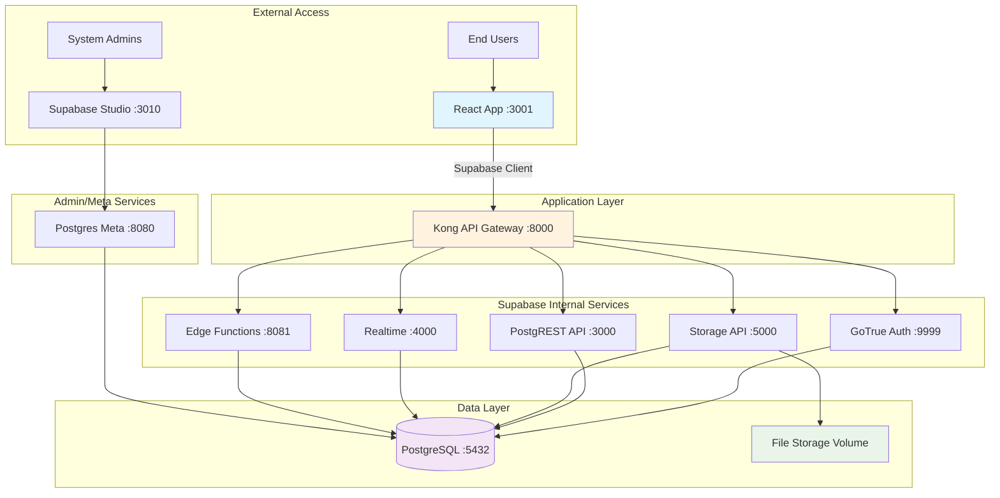
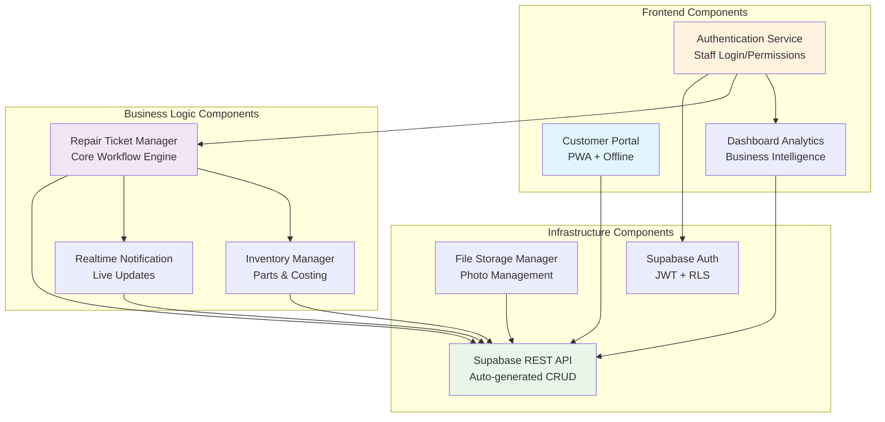
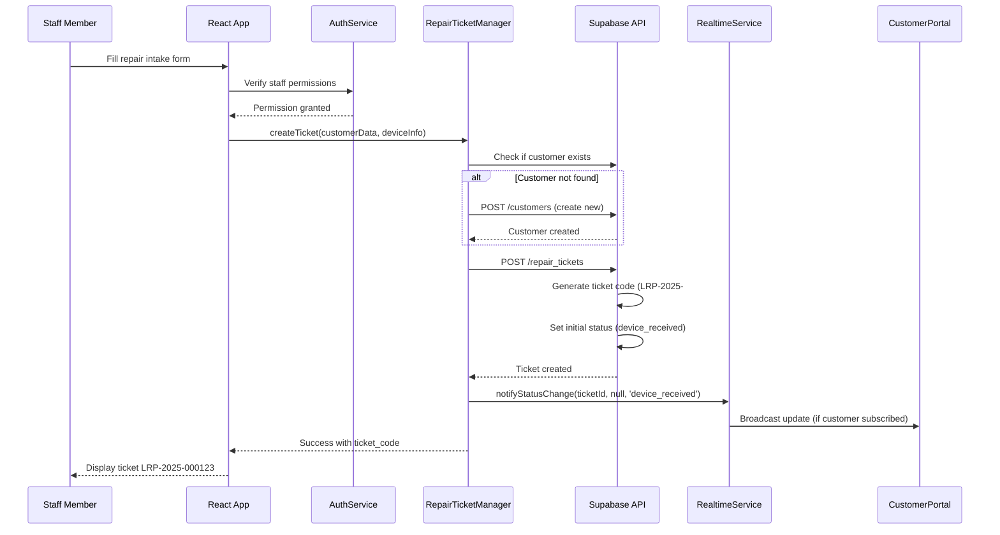
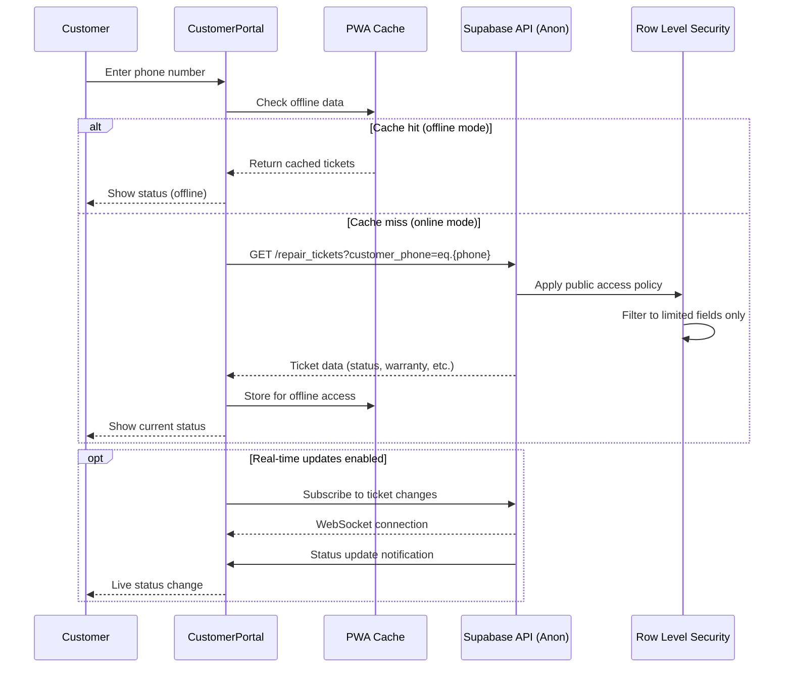
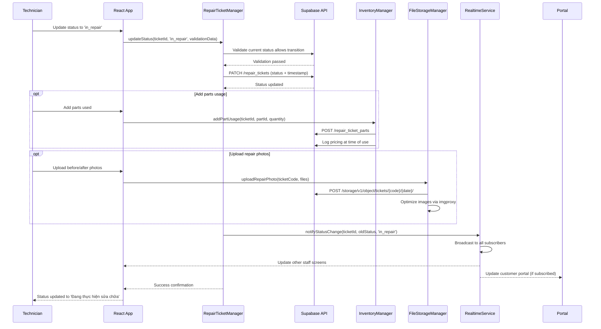

# Hệ thống Quản lý Sửa chữa Laptop Fullstack Architecture Document

## Introduction

This document outlines the complete fullstack architecture for **Hệ thống Quản lý Sửa chữa Laptop** (Vietnamese Laptop Repair Management System), including backend systems, frontend implementation, and their integration. It serves as the single source of truth for AI-driven development, ensuring consistency across the entire technology stack.

This unified approach combines what would traditionally be separate backend and frontend architecture documents, streamlining the development process for modern fullstack applications where these concerns are increasingly intertwined.

The system serves a small laptop repair shop (<10 employees) transitioning from WordPress to a comprehensive management platform handling repair workflows, customer management, parts inventory, and public repair ticket lookup.

### Starter Template Analysis

**Template Assessment:** Your project uses a **self-hosted Supabase stack** via Docker rather than standard starter templates. Key architectural constraints already established:

- **Backend:** Self-hosted Supabase via Docker (PostgreSQL, Auth, Storage, Real-time, RLS)
- **Frontend:** Vite + React 19 + TanStack Router + TypeScript
- **Infrastructure:** All-in-one Docker Compose with **Supabase's internal Kong API gateway**
- **Deployment Model:** Single environment (no dev/prod separation)
- **Environment Setup:** 3-phase approach (make env → make init → make data)

### CRITICAL Kong Architecture Understanding

**Kong is Supabase's INTERNAL API Gateway** - Kong aggregates ALL Supabase services (auth, rest, storage, realtime, functions) through a single endpoint (localhost:8000).

**Connection Flow:**
```
React App → Supabase Client → Kong (localhost:8000) → Internal Supabase Services
                                    ├── Auth Service (:9999)
                                    ├── PostgREST API (:3000)
                                    ├── Storage Service (:5000)
                                    ├── Realtime Service (:4000)
                                    └── Edge Functions (:8081)
```

**Only 3 services exposed externally:**
- **Port 3001:** React Application (for end users)
- **Port 8000/8443:** Kong/Supabase API (for React app via Supabase client)
- **Port 3010:** Studio (for database management)

**The React app runs independently** and connects ONLY to Kong endpoint, never directly to individual Supabase services.

### Change Log

| Date | Version | Description | Author |
|------|---------|-------------|--------|
| 2025-01-22 | 1.0 | Initial architecture document | Winston (Architect Agent) |

## High Level Architecture

### Technical Summary

This Vietnamese laptop repair management system implements a **self-hosted Supabase + React 19 monolithic architecture** optimized for small business operations. The system uses Docker Compose to orchestrate a complete Supabase backend stack (PostgreSQL with RLS, GoTrue auth, real-time subscriptions, file storage) behind Kong's internal API gateway, paired with a modern React 19 frontend using TanStack Router for sophisticated client-side routing. The architecture prioritizes **operational simplicity** through single-environment deployment while maintaining enterprise-grade features like real-time repair status updates, role-based access control, and PWA capabilities for offline customer portal access. This approach eliminates traditional dev/ops complexity while providing the scalability and security needed for a growing repair business.

### Platform and Infrastructure Choice

**Platform:** Self-hosted Docker Compose on single server/VPS
**Key Services:** Supabase stack (PostgreSQL, GoTrue, PostgREST, Realtime, Storage, Kong), React 19 with Vite
**Deployment Host and Regions:** Single deployment region (customer's preferred hosting location)

### Repository Structure

**Structure:** Monorepo with separated frontend/backend concerns
**Monorepo Tool:** pnpm workspaces (lightweight, fast)
**Package Organization:** Clear separation between React app, Supabase configuration, and shared types/utilities

### High Level Architecture Diagram



### Architectural Patterns

- **Self-hosted Supabase Architecture:** Complete backend-as-a-service running in controlled environment - _Rationale:_ Provides enterprise features (RLS, real-time, auth) without vendor lock-in or recurring cloud costs
- **Component-Based React UI:** Modern React 19 with shadcn/ui components and TypeScript - _Rationale:_ Maintainable, type-safe frontend with excellent developer experience and Vietnamese localization support
- **API Gateway Pattern:** Kong consolidates all backend services through single endpoint - _Rationale:_ Simplifies client configuration and provides centralized auth/routing for Supabase services
- **Progressive Web App (PWA):** Offline-capable public pages with online-only authenticated sections - _Rationale:_ Customers can check repair status offline while staff operations require real-time data
- **Row Level Security (RLS):** Database-level access control for multi-tenant data isolation - _Rationale:_ Ensures customers only see their repair data while staff see appropriate subsets based on roles
- **File-based Routing:** TanStack Router with automatic route generation - _Rationale:_ Scales well with Vietnamese URL structure (/sua-laptop, /phieu-sua-chua) and provides type-safe navigation

## Tech Stack

### Technology Stack Table

| Category | Technology | Version | Purpose | Rationale |
|----------|------------|---------|---------|-----------|
| Frontend Language | TypeScript | 5.0+ | Type-safe JavaScript development | Essential for large codebase maintainability and Vietnamese language handling |
| Frontend Framework | React | 19.0+ | Component-based UI framework | Latest React with concurrent features, excellent ecosystem for repair shop workflows |
| Frontend Build Tool | Vite | 5.0+ | Fast development server and bundler | Superior hot reload performance, optimized for React 19 development |
| UI Component Library | shadcn/ui | Latest | Pre-built accessible components | Consistent Vietnamese-friendly design system with Tailwind integration |
| CSS Framework | Tailwind CSS | 4.0+ | Utility-first styling | Rapid UI development with excellent mobile responsiveness for repair workflows |
| Frontend Router | TanStack Router | 1.0+ | Type-safe client-side routing | File-based routing perfect for Vietnamese URL structure (/sua-laptop, /khach-hang) |
| State Management | React Built-in | React 19 | useState/useReducer/Context | Simple state needs, avoid over-engineering for small repair shop scope |
| Backend Platform | Supabase (Self-hosted) | Latest | Complete backend-as-a-service | PostgreSQL + Auth + Storage + Realtime + RLS in Docker container |
| Database | PostgreSQL | 15.8+ | Primary data store | ACID compliance for repair records, excellent JSON support, integrated with Supabase |
| API Style | Supabase Auto-generated REST | PostgREST | Database-to-API conversion | Automatic API generation from PostgreSQL schema with RLS integration |
| Authentication | Supabase Auth (GoTrue) | 2.177+ | User authentication and authorization | JWT-based auth with row-level security, perfect for staff/customer separation |
| File Storage | Supabase Storage | 1.25+ | Repair photos and documents | S3-compatible API with image transformation via imgproxy |
| Real-time | Supabase Realtime | 2.34+ | Live repair status updates | WebSocket connections for real-time repair progress notifications |
| API Gateway | Kong (Supabase Internal) | 2.8.1 | Service mesh for Supabase | Consolidates all Supabase services through single endpoint |
| Frontend Testing | Vitest | Latest | Unit and integration testing | Vite-native testing, fast execution for React components |
| E2E Testing | Playwright | Latest | End-to-end workflow testing | Cross-browser testing for repair ticket workflows and customer portal |
| Package Manager | pnpm | 8.0+ | Fast, efficient dependency management | Disk space efficient, excellent monorepo support |
| Linting/Formatting | Biome | Latest | Code quality and formatting | All-in-one tool replacing ESLint + Prettier with better performance |
| Container Platform | Docker Compose | Latest | Service orchestration | Single-file deployment for all Supabase services |
| Environment Setup | Make | System | Build automation | Simple command interface (make env, make init, make data) |
| Development Server | Vite Dev Server | 5.0+ | Hot module replacement | Fast refresh for React 19 development |
| PWA Support | Vite PWA Plugin | Latest | Progressive web app capabilities | Offline customer portal for repair status lookup |
| Image Processing | imgproxy (via Supabase) | 3.8+ | Repair photo optimization | Automatic image resizing and format conversion |
| Database UI | Supabase Studio | Latest | Database administration | Web-based PostgreSQL management interface |

## Data Models

### RepairTicket

**Purpose:** Central entity representing a laptop repair request from initial intake through completion, with comprehensive status tracking and payment management.

**Key Attributes:**
- `ticket_code`: string - Unique identifier (LRP-YYYY-###### format)
- `customer_phone`: string - Primary key reference to customer (Vietnamese phone format)
- `device_info`: object - Laptop model, serial number, initial condition
- `issue_description`: string - Customer-reported problem description
- `status`: enum - Current repair stage (16 possible states from project brief)
- `assigned_technician_id`: uuid - Staff member responsible for repair
- `created_at`: timestamp - Initial ticket creation
- `estimated_completion`: timestamp - Projected completion date
- `total_cost`: decimal - Final repair price
- `deposit_amount`: decimal - Upfront payment received
- `is_paid`: boolean - Payment completion status
- `warranty_until`: date - Warranty expiration date

#### TypeScript Interface
```typescript
interface RepairTicket {
  id: string;
  ticket_code: string; // LRP-2025-000123
  customer_phone: string;
  device_info: {
    brand: string;
    model: string;
    serial_number?: string;
    initial_condition: string;
  };
  issue_description: string;
  status: RepairStatus;
  assigned_technician_id?: string;
  created_at: string;
  updated_at: string;
  estimated_completion?: string;
  total_cost?: number;
  deposit_amount?: number;
  is_paid: boolean;
  paid_at?: string;
  payment_method?: 'cash' | 'transfer' | 'other';
  warranty_until?: string;
  // Validation fields for status transitions
  has_issue_report: boolean;
  customer_approved_at?: string;
  repair_completed_at?: string;
}

type RepairStatus =
  | 'device_received' | 'preliminary_inspection' | 'awaiting_repair_plan'
  | 'approved_for_repair' | 'in_diagnosis' | 'waiting_parts' | 'in_repair'
  | 'quality_testing' | 'ready_for_pickup' | 'completed'
  | 'cannot_repair' | 'cancelled_by_customer' | 'repair_failed'
  | 'customer_no_show' | 'ready_for_return' | 'abandoned';
```

#### Relationships
- Belongs to one Customer (via customer_phone)
- Has many RepairTicketPhotos (before/after images)
- Has many InternalComments (staff notes)
- Assigned to one UserProfile (technician)

### Customer

**Purpose:** Represents repair service customers with phone number as primary identifier, supporting the Vietnamese business model where customers don't need accounts.

**Key Attributes:**
- `phone`: string - Primary key (Vietnamese phone number format)
- `full_name`: string - Customer's full name
- `address`: text - Physical address for device pickup/delivery
- `notes`: text - Internal staff notes about customer preferences/history
- `created_at`: timestamp - First interaction date
- `total_repairs`: integer - Count of completed repairs (computed)

#### TypeScript Interface
```typescript
interface Customer {
  phone: string; // Primary key
  full_name: string;
  address?: string;
  notes?: string;
  created_at: string;
  updated_at: string;
  total_repairs?: number; // Computed field
}
```

#### Relationships
- Has many RepairTickets
- No authentication (customers access via phone lookup only)

### UserProfile

**Purpose:** Staff members who use the authenticated system, with role-based permissions for repair shop operations.

**Key Attributes:**
- `id`: uuid - Primary key (linked to Supabase auth)
- `email`: string - Login credential
- `full_name`: string - Staff member name
- `role`: enum - Permission level (shop_owner, staff)
- `is_active`: boolean - Employment status
- `phone`: string - Staff contact number

#### TypeScript Interface
```typescript
interface UserProfile {
  id: string; // UUID from Supabase auth
  email: string;
  full_name: string;
  role: 'shop_owner' | 'staff';
  is_active: boolean;
  phone?: string;
  created_at: string;
  updated_at: string;
}
```

#### Relationships
- Linked to Supabase Auth user
- Has many assigned RepairTickets
- Can create InternalComments

### Part

**Purpose:** Inventory items used in laptop repairs, with simple stock tracking and pricing history.

**Key Attributes:**
- `id`: uuid - Primary key
- `name`: string - Part description
- `category`: string - Classification (screen, keyboard, battery, etc.)
- `brand`: string - Manufacturer
- `model_compatibility`: array - Compatible laptop models
- `current_stock`: integer - Available quantity (simplified tracking)
- `unit_cost`: decimal - Purchase price
- `unit_price`: decimal - Sale price to customers
- `supplier_info`: text - Vendor contact information

#### TypeScript Interface
```typescript
interface Part {
  id: string;
  name: string;
  category: string;
  brand?: string;
  model_compatibility: string[];
  current_stock: number;
  unit_cost: number;
  unit_price: number;
  supplier_info?: string;
  created_at: string;
  updated_at: string;
}
```

#### Relationships
- Used in many RepairTickets (via `parts_used` field)
- Belongs to PartCategory (classification)

### RepairTicketPart (Removed)

**Purpose:** This has been removed for simplicity. Parts used are now tracked in the `parts_used` field on the `RepairTicket` table.

## API Specification

### Supabase Auto-generated REST API

**API Base URL:** `http://localhost:8000/rest/v1/` (via Kong)
**Authentication:** Bearer JWT tokens (anon key for public access, user JWT for authenticated)
**Content-Type:** `application/json`

#### Core API Endpoints

**Repair Tickets Management:**
```yaml
# Get all repair tickets (staff only, with RLS filtering)
GET /rest/v1/repair_tickets
Authorization: Bearer {user_jwt}

# Create new repair ticket
POST /rest/v1/repair_tickets
Authorization: Bearer {user_jwt}
Content-Type: application/json
{
  "customer_phone": "+84901234567",
  "device_info": {
    "brand": "Dell",
    "model": "Inspiron 15 3000",
    "initial_condition": "Màn hình bị vỡ"
  },
  "issue_description": "Màn hình laptop bị vỡ sau khi rơi"
}

# Update repair status
PATCH /rest/v1/repair_tickets?id=eq.{ticket_id}
Authorization: Bearer {user_jwt}
{
  "status": "in_repair",
  "assigned_technician_id": "{technician_uuid}"
}

# Public ticket lookup (no auth required)
GET /rest/v1/repair_tickets?customer_phone=eq.{phone}&select=ticket_code,status,device_info,created_at,warranty_until
Authorization: Bearer {anon_key}
```

**Customer Management:**
```yaml
# Get customer details (staff only)
GET /rest/v1/customers?phone=eq.{phone}
Authorization: Bearer {user_jwt}

# Create customer (auto-created on first ticket)
POST /rest/v1/customers
Authorization: Bearer {user_jwt}
{
  "phone": "+84901234567",
  "full_name": "Nguyễn Văn An",
  "address": "123 Đường ABC, Quận 1, TP.HCM"
}
```

**File Upload (Repair Photos):**
```yaml
# Upload repair photos
POST /storage/v1/object/tickets/{ticket_code}/{date}/photo.jpg
Authorization: Bearer {user_jwt}
Content-Type: image/jpeg

# Get signed URL for photo
POST /storage/v1/object/sign/tickets/{ticket_code}/{date}/photo.jpg
Authorization: Bearer {user_jwt}
{
  "expiresIn": 3600
}
```

**Real-time Subscriptions:**
```yaml
# Subscribe to repair ticket updates
WebSocket: ws://localhost:8000/realtime/v1/websocket
{
  "topic": "realtime:public:repair_tickets",
  "event": "phx_join",
  "payload": {
    "config": {
      "postgres_changes": [
        {
          "event": "UPDATE",
          "schema": "public",
          "table": "repair_tickets",
          "filter": "customer_phone=eq.{phone}"
        }
      ]
    }
  }
}
```

#### Row Level Security (RLS) Policies

**Public Access (Anon Key):**
- `repair_tickets`: Read-only, limited fields (ticket_code, status, warranty_until)
- `customers`: No access

**Staff Access (User JWT):**
- `repair_tickets`: Full CRUD for `shop_owner`, limited for `staff`
- `customers`: Read all, create/update based on role
- `parts`: Read all, update for `shop_owner`
- `user_profiles`: Read all active users

**Data Isolation:**
- Customers only see their own tickets via phone lookup
- Staff see tickets based on assignment and role permissions
- `shop_owner` sees all data without restrictions

## Components

### AuthenticationService

**Responsibility:** Manages user authentication, session handling, and role-based access control for staff members using Supabase Auth.

**Key Interfaces:**
- `signIn(email, password)` - Staff login
- `signOut()` - Session termination
- `getCurrentUser()` - Get authenticated user profile
- `checkPermissions(action, resource)` - Role-based access validation

**Dependencies:** Supabase Auth, UserProfile data model

**Technology Stack:** Supabase GoTrue, React Context, TypeScript interfaces

### RepairTicketManager

**Responsibility:** Core business logic for repair ticket lifecycle management, status transitions, and workflow validation.

**Key Interfaces:**
- `createTicket(customerData, deviceInfo)` - New repair intake
- `updateStatus(ticketId, newStatus, validationData)` - Status progression
- `assignTechnician(ticketId, technicianId)` - Task assignment
- `validateStatusTransition(current, target, ticket)` - Business rule validation
- `generateTicketCode(year)` - Sequential ticket numbering

**Dependencies:** RepairTicket, Customer, UserProfile models; Supabase database

**Technology Stack:** PostgreSQL functions, Supabase PostgREST, TypeScript validation

### CustomerPortal

**Responsibility:** Public-facing interface for customers to lookup repair status without authentication, optimized for mobile and offline use.

**Key Interfaces:**
- `lookupTickets(phoneNumber)` - Phone-based ticket search
- `getTicketStatus(ticketCode)` - Individual ticket details
- `getWarrantyInfo(ticketCode)` - Warranty status lookup
- `enableOfflineAccess()` - PWA offline functionality

**Dependencies:** Supabase anon key access, RepairTicket model (limited fields)

**Technology Stack:** React 19 PWA, TanStack Router, Service Worker, Cache API

### FileStorageManager

**Responsibility:** Handles repair photo uploads, image optimization, and secure file access with automatic organization by ticket and date.

**Key Interfaces:**
- `uploadRepairPhoto(ticketCode, file, category)` - Photo upload with metadata
- `getSignedUrl(filePath, expiresIn)` - Secure file access
- `optimizeImage(file, options)` - Automatic resize/compression
- `organizeByTicket(ticketCode, date)` - File system organization

**Dependencies:** Supabase Storage, imgproxy service, RepairTicket model

**Technology Stack:** Supabase Storage API, imgproxy, React file upload, image processing

### RealtimeNotificationService

**Responsibility:** Provides live updates for repair status changes, enabling real-time communication between staff and automatic customer notifications.

**Key Interfaces:**
- `subscribeToTicketUpdates(ticketId, callback)` - Real-time status monitoring
- `notifyStatusChange(ticketId, oldStatus, newStatus)` - Status broadcast
- `manageSubscriptions(userId, permissions)` - Role-based subscription filtering
- `handleConnectionState()` - WebSocket connection management

**Dependencies:** Supabase Realtime, RepairTicket model, UserProfile permissions

**Technology Stack:** Supabase Realtime WebSockets, React hooks, TypeScript event handling

### InventoryManager

**Responsibility:** Parts inventory tracking, usage logging, and cost calculation for repair tickets with simplified stock management.

**Key Interfaces:**
- `addPartUsage(ticketId, partId, quantity)` - Log part consumption
- `checkStockAvailability(partId, quantity)` - Stock validation
- `calculateTicketCosts(ticketId)` - Total cost computation

**Dependencies:** Part, RepairTicket models, UserProfile permissions

**Technology Stack:** PostgreSQL calculations, Supabase functions, TypeScript business logic

### DashboardAnalytics

**Responsibility:** Business intelligence and reporting for repair shop operations, with role-based data access and Vietnamese business metrics.

**Key Interfaces:**
- `getDashboardStats(userId, dateRange)` - Key performance indicators
- `getRepairMetrics(period)` - Repair volume and timing analysis
- `getRevenueReport(period, permissions)` - Financial summaries
- `getTechnicianPerformance(period)` - Staff productivity metrics

**Dependencies:** All data models, UserProfile permissions, date range filtering

**Technology Stack:** PostgreSQL aggregations, Supabase views, React visualization components

### Component Interaction Diagram



## Core Workflows

### Workflow 1: New Repair Ticket Creation



### Workflow 2: Customer Ticket Lookup (Public)



### Workflow 3: Repair Status Progression



## Database Schema

### PostgreSQL Database Schema

Based on PostgreSQL 15.8+ with Supabase extensions, RLS policies, and Vietnamese business requirements:

```sql
-- =====================================================
-- DATABASE SCHEMA FOR VIETNAMESE LAPTOP REPAIR SYSTEM
-- =====================================================

-- Enable required extensions
CREATE EXTENSION IF NOT EXISTS "uuid-ossp";
CREATE EXTENSION IF NOT EXISTS "pgcrypto";

-- =====================================================
-- ENUMS AND CUSTOM TYPES
-- =====================================================

-- Repair ticket status enum (16 states from project brief)
CREATE TYPE repair_status AS ENUM (
  'device_received',           -- Đã tiếp nhận thiết bị
  'preliminary_inspection',    -- Đang kiểm tra ban đầu
  'awaiting_repair_plan',     -- Chờ xác nhận phương án sửa chữa
  'approved_for_repair',      -- Đã xác nhận sửa chữa
  'in_diagnosis',             -- Đang chẩn đoán chi tiết
  'waiting_parts',            -- Đang đặt hàng linh kiện
  'in_repair',                -- Đang thực hiện sửa chữa
  'quality_testing',          -- Đang kiểm tra chất lượng
  'ready_for_pickup',         -- Sẵn sàng nhận máy
  'completed',                -- Đã hoàn thành
  'cannot_repair',            -- Không thể sửa chữa
  'cancelled_by_customer',    -- Đã hủy sửa chữa
  'repair_failed',            -- Sửa chữa gặp khó khăn
  'customer_no_show',         -- Chờ khách hàng liên hệ
  'ready_for_return',         -- Sẵn sàng trả máy
  'abandoned'                 -- Liên hệ để nhận máy
);

-- User roles enum
CREATE TYPE user_role AS ENUM (
  'shop_owner',
  'staff'
);

-- Payment methods enum
CREATE TYPE payment_method AS ENUM (
  'cash',
  'transfer',
  'other'
);

-- =====================================================
-- CORE TABLES
-- =====================================================

-- Customers table (phone as primary key)
CREATE TABLE customers (
  phone VARCHAR(20) PRIMARY KEY,  -- Vietnamese phone number format
  full_name VARCHAR(255) NOT NULL,
  address TEXT,
  notes TEXT,                     -- Internal staff notes
  created_at TIMESTAMPTZ DEFAULT NOW(),
  updated_at TIMESTAMPTZ DEFAULT NOW()
);

-- User profiles (linked to Supabase auth)
CREATE TABLE user_profiles (
  id UUID PRIMARY KEY REFERENCES auth.users(id) ON DELETE CASCADE,
  email VARCHAR(255) UNIQUE NOT NULL,
  full_name VARCHAR(255) NOT NULL,
  role user_role NOT NULL DEFAULT 'staff',
  is_active BOOLEAN DEFAULT TRUE,
  phone VARCHAR(20),
  created_at TIMESTAMPTZ DEFAULT NOW(),
  updated_at TIMESTAMPTZ DEFAULT NOW()
);

-- Repair tickets table
CREATE TABLE repair_tickets (
  id UUID PRIMARY KEY DEFAULT uuid_generate_v4(),
  ticket_code VARCHAR(20) UNIQUE NOT NULL, -- LRP-2025-000123
  customer_phone VARCHAR(20) NOT NULL REFERENCES customers(phone),
  device_info JSONB NOT NULL,             -- {brand, model, serial_number, initial_condition}
  issue_description TEXT NOT NULL,
  status repair_status DEFAULT 'device_received',
  assigned_technician_id UUID REFERENCES user_profiles(id),
  parts_used JSONB,                       -- [{part_id, name, quantity, unit_price}]

  -- Timestamps
  created_at TIMESTAMPTZ DEFAULT NOW(),
  updated_at TIMESTAMPTZ DEFAULT NOW(),
  estimated_completion TIMESTAMPTZ,

  -- Financial fields
  total_cost DECIMAL(12,2),
  deposit_amount DECIMAL(12,2),
  is_paid BOOLEAN DEFAULT FALSE,
  paid_at TIMESTAMPTZ,
  payment_method payment_method,
  receipt_note TEXT,

  -- Warranty
  warranty_until DATE,

  -- Status transition validation fields
  has_issue_report BOOLEAN DEFAULT FALSE,
  customer_approved_at TIMESTAMPTZ,
  customer_approved_by UUID REFERENCES user_profiles(id),
  repair_completed_at TIMESTAMPTZ,
  repair_completed_by UUID REFERENCES user_profiles(id),
  paid_by UUID REFERENCES user_profiles(id)
);

-- Parts inventory table
CREATE TABLE parts (
  id UUID PRIMARY KEY DEFAULT uuid_generate_v4(),
  name VARCHAR(255) NOT NULL,
  category VARCHAR(100) NOT NULL,
  brand VARCHAR(100),
  model_compatibility TEXT[],             -- Array of compatible laptop models
  current_stock INTEGER DEFAULT 10000,    -- Simplified stock (per project brief)
  unit_cost DECIMAL(12,2) NOT NULL,
  unit_price DECIMAL(12,2) NOT NULL,
  supplier_info TEXT,
  created_at TIMESTAMPTZ DEFAULT NOW(),
  updated_at TIMESTAMPTZ DEFAULT NOW()
);

-- Parts usage in repairs has been removed for simplicity.
-- Parts are now tracked in the `parts_used` JSONB field on the `repair_tickets` table.


-- =====================================================
-- BUSINESS LOGIC FUNCTIONS
-- =====================================================

-- Generate sequential ticket code
CREATE OR REPLACE FUNCTION generate_ticket_code(year INTEGER)
RETURNS TEXT AS $$
DECLARE
  next_number INTEGER;
  code TEXT;
BEGIN
  -- Get next sequence number for the year
  SELECT nextval('ticket_sequence') INTO next_number;

  -- Format as LRP-YYYY-NNNNNN
  code := 'LRP-' || year::TEXT || '-' || lpad(next_number::TEXT, 6, '0');

  RETURN code;
END;
$$ LANGUAGE plpgsql;

-- Validate status transitions
CREATE OR REPLACE FUNCTION validate_status_transition(
  current_status repair_status,
  new_status repair_status,
  ticket_uuid UUID
)
RETURNS BOOLEAN AS $$
DECLARE
  ticket_record repair_tickets%ROWTYPE;
BEGIN
  SELECT * INTO ticket_record FROM repair_tickets WHERE id = ticket_uuid;

  -- Business rules from project brief
  CASE
    WHEN current_status = 'preliminary_inspection' AND new_status = 'awaiting_repair_plan' THEN
      RETURN ticket_record.has_issue_report = TRUE;
    WHEN current_status = 'awaiting_repair_plan' AND new_status = 'approved_for_repair' THEN
      RETURN ticket_record.customer_approved_at IS NOT NULL;
    WHEN current_status = 'in_repair' AND new_status = 'quality_testing' THEN
      RETURN ticket_record.repair_completed_at IS NOT NULL;
    WHEN current_status = 'ready_for_pickup' AND new_status = 'completed' THEN
      RETURN ticket_record.is_paid = TRUE AND ticket_record.paid_at IS NOT NULL;
    ELSE
      RETURN TRUE; -- Allow other transitions
  END CASE;
END;
$$ LANGUAGE plpgsql;
```

## Frontend Architecture

### Component Architecture

#### Component Organization
```
src/
├── components/
│   ├── ui/                     # shadcn/ui base components
│   ├── common/                 # Shared application components
│   ├── pages/                  # Page-level components
│   ├── features/               # Business domain components
│   │   ├── repair-tickets/
│   │   ├── customers/
│   │   └── parts/
│   └── customer-portal/        # Public-facing components
```

#### Component Template
```typescript
// Example: RepairTicketCard.tsx
import { RepairTicket } from '@/shared/types'
import { Button } from '@/components/ui/button'
import { Card, CardContent, CardHeader, CardTitle } from '@/components/ui/card'

interface RepairTicketCardProps {
  ticket: RepairTicket
  onStatusUpdate?: (ticketId: string, newStatus: string) => void
  showCustomerInfo?: boolean
}

export function RepairTicketCard({ ticket, onStatusUpdate, showCustomerInfo = true }: RepairTicketCardProps) {
  return (
    <Card className="hover:shadow-md transition-shadow">
      <CardHeader className="pb-3">
        <CardTitle className="text-lg font-medium">
          {ticket.ticket_code}
        </CardTitle>
        <p className="text-sm text-muted-foreground">
          {ticket.device_info.brand} {ticket.device_info.model}
        </p>
      </CardHeader>
      <CardContent>
        {showCustomerInfo && (
          <p className="text-sm mb-2">
            <span className="font-medium">Khách hàng:</span> {ticket.customer_name}
          </p>
        )}
        <div className="flex gap-2">
          <Button variant="outline" size="sm">Xem chi tiết</Button>
        </div>
      </CardContent>
    </Card>
  )
}
```

### State Management Architecture

#### State Structure
```typescript
interface AppState {
  auth: {
    user: UserProfile | null
    isLoading: boolean
    isAuthenticated: boolean
  }
  ui: {
    theme: 'light' | 'dark'
    sidebarOpen: boolean
    isOffline: boolean
  }
  cache: {
    repairTickets: Map<string, RepairTicket>
    customers: Map<string, Customer>
    parts: Map<string, Part>
  }
}
```

### Routing Architecture

#### Route Organization
```typescript
src/routes/
├── __root.tsx                 # Root layout
├── index.tsx                  # Public homepage
├── sua-laptop/
│   └── tra-cuu.tsx           # Public ticket lookup
├── login.tsx                  # Staff authentication
└── dashboard/
    ├── index.tsx             # Dashboard overview
    ├── phieu-sua-chua/       # Repair tickets
    ├── khach-hang/           # Customers
    └── admin/                # Administration
```

### Frontend Services Layer

#### API Client Setup
```typescript
import { createClient } from '@supabase/supabase-js'

const supabaseUrl = import.meta.env.VITE_SUPABASE_URL || 'http://localhost:8000'
const supabaseAnonKey = import.meta.env.VITE_SUPABASE_ANON_KEY

export const supabase = createClient(supabaseUrl, supabaseAnonKey, {
  auth: {
    autoRefreshToken: true,
    persistSession: true
  },
  realtime: {
    params: { eventsPerSecond: 10 }
  }
})
```

#### Service Example
```typescript
export class RepairTicketService {
  static async createTicket(data: CreateTicketRequest): Promise<RepairTicket> {
    const year = new Date().getFullYear()
    const { data: ticketCode } = await supabase.rpc('generate_ticket_code', { year })

    const { data: ticket, error } = await supabase
      .from('repair_tickets')
      .insert({
        ticket_code: ticketCode,
        customer_phone: data.customer_phone,
        device_info: data.device_info,
        issue_description: data.issue_description
      })
      .select()
      .single()

    if (error) throw error
    return ticket
  }
}
```

## Unified Project Structure

```
laptop-repair-system/
├── .github/workflows/          # CI/CD
├── apps/
│   ├── web/                   # React frontend
│   │   ├── src/
│   │   │   ├── components/    # UI components
│   │   │   ├── pages/         # Page components
│   │   │   ├── hooks/         # Custom hooks
│   │   │   ├── services/      # API services
│   │   │   └── lib/           # Utilities
│   │   ├── public/            # Static assets
│   │   └── package.json
│   └── supabase/              # Supabase configuration
│       ├── migrations/        # Database migrations
│       ├── functions/         # Edge functions
│       └── config/
├── packages/
│   ├── shared/                # Shared types/utilities
│   │   ├── types/             # TypeScript interfaces
│   │   └── utils/             # Common utilities
│   └── ui/                    # Shared components
├── docker-compose.yml         # Development environment
├── Makefile                   # Build automation
├── .env.example               # Environment template
└── docs/                      # Documentation
    ├── architecture.md
    ├── project-brief.md
    └── env.md
```

## Development Workflow

### Local Development Setup

#### Prerequisites
```bash
# Install required tools
curl -fsSL https://get.docker.com -o get-docker.sh && sh get-docker.sh
curl -fsSL https://get.pnpm.io/install.sh | sh -
```

#### Initial Setup
```bash
# Clone and setup
git clone <repository>
cd laptop-repair-system
cp .env.example .env
# Edit .env with your values
pnpm install
```

#### Development Commands
```bash
# Start all services (3-phase approach)
make clean          # Reset everything
make env           # Start infrastructure
make init          # Create admin account
make data          # Add sample data (optional)

# Individual services
pnpm dev           # Frontend only (localhost:3001)
make studio        # Database UI (localhost:3010)
```

### Environment Configuration

#### Required Environment Variables
```bash
# Frontend (.env)
VITE_SUPABASE_URL=http://localhost:8000
VITE_SUPABASE_ANON_KEY=your-anon-key
VITE_SERVICE_ROLE_KEY=your-service-role-key

# Backend (same .env)
POSTGRES_PASSWORD=your-postgres-password
JWT_SECRET=your-jwt-secret
SHOP_ADMIN_EMAIL=admin@laptop-repair-shop.local
SHOP_ADMIN_PASSWORD=AdminPass123!
```

## Deployment Architecture

### Deployment Strategy

**Frontend Deployment:**
- **Platform:** Static hosting (Vercel/Netlify) or Docker container
- **Build Command:** `pnpm build`
- **Output Directory:** `dist/`

**Backend Deployment:**
- **Platform:** Docker Compose on VPS
- **Deployment Method:** `make env && make init`
- **Data Persistence:** Docker volumes

### Environments

| Environment | Frontend URL | Backend URL | Purpose |
|-------------|--------------|-------------|---------|
| Development | http://localhost:3001 | http://localhost:8000 | Local development |
| Production | https://your-domain.com | https://api.your-domain.com | Live environment |

## Security and Performance

### Security Requirements

**Frontend Security:**
- CSP Headers: Strict content security policy
- XSS Prevention: Input sanitization and output encoding
- Secure Storage: Encrypted localStorage for sensitive data

**Backend Security:**
- Input Validation: Zod schema validation on all inputs
- Rate Limiting: Kong rate limiting configuration
- CORS Policy: Restricted to frontend domain only

**Authentication Security:**
- Token Storage: HttpOnly cookies for JWT tokens
- Session Management: Supabase automatic refresh
- Password Policy: Minimum 8 characters with complexity

### Performance Optimization

**Frontend Performance:**
- Bundle Size Target: < 500KB gzipped
- Loading Strategy: Route-based code splitting
- Caching Strategy: Service Worker for offline support

**Backend Performance:**
- Response Time Target: < 200ms for API calls
- Database Optimization: Proper indexing and RLS policies
- Caching Strategy: Redis for session data (if needed)

## Testing Strategy

### Test Organization

**Frontend Tests:**
```
src/
├── __tests__/                 # Unit tests
├── components/__tests__/      # Component tests
└── e2e/                       # Playwright E2E tests
```

**Backend Tests:**
```
supabase/
├── tests/
│   ├── functions/             # Edge function tests
│   └── database/              # Database function tests
```

### Test Examples

**Frontend Component Test:**
```typescript
import { render, screen } from '@testing-library/react'
import { RepairTicketCard } from '@/components/features/repair-tickets/RepairTicketCard'

test('displays ticket information correctly', () => {
  const ticket = { ticket_code: 'LRP-2025-000001', /* ... */ }
  render(<RepairTicketCard ticket={ticket} />)
  expect(screen.getByText('LRP-2025-000001')).toBeInTheDocument()
})
```

**E2E Test:**
```typescript
import { test, expect } from '@playwright/test'

test('staff can create repair ticket', async ({ page }) => {
  await page.goto('/login')
  await page.fill('[data-testid=email]', 'admin@laptop-repair-shop.local')
  await page.fill('[data-testid=password]', 'AdminPass123!')
  await page.click('[data-testid=login-button]')

  await page.goto('/dashboard/phieu-sua-chua')
  await page.click('[data-testid=create-ticket-button]')
  // ... rest of test
})
```

## Coding Standards

### Critical Fullstack Rules
- **Type Sharing:** Always define types in packages/shared and import consistently
- **API Calls:** Never make direct HTTP calls - always use the service layer abstraction
- **Environment Variables:** Access only through config objects, never process.env directly
- **Error Handling:** All API routes must use standardized error handler with Vietnamese messages
- **State Updates:** Never mutate state directly - use proper React state management patterns

### Naming Conventions

| Element | Frontend | Backend | Example |
|---------|----------|---------|---------|
| Components | PascalCase | - | `UserProfile.tsx` |
| Hooks | camelCase with 'use' | - | `useAuth.ts` |
| API Routes | - | kebab-case | `/api/repair-tickets` |
| Database Tables | - | snake_case | `repair_tickets` |

## Error Handling Strategy

### Error Response Format
```typescript
interface ApiError {
  error: {
    code: string;
    message: string;
    details?: Record<string, any>;
    timestamp: string;
  };
}
```

### Frontend Error Handling
```typescript
export function useErrorHandler() {
  return (error: unknown) => {
    if (error instanceof SupabaseError) {
      toast.error(`Lỗi hệ thống: ${error.message}`)
    } else {
      toast.error('Đã xảy ra lỗi không xác định')
    }
  }
}
```

## Monitoring and Observability

### Monitoring Stack
- **Frontend Monitoring:** Browser performance monitoring via Web Vitals
- **Backend Monitoring:** Supabase built-in analytics and logging
- **Error Tracking:** Console logging with structured error reporting
- **Performance Monitoring:** Real User Monitoring (RUM) for frontend performance

### Key Metrics

**Frontend Metrics:**
- Core Web Vitals (LCP, FID, CLS)
- JavaScript errors and stack traces
- API response times from frontend perspective
- User interaction success rates

**Backend Metrics:**
- API request rate and response times
- Database query performance
- Error rates by endpoint
- Authentication success/failure rates
