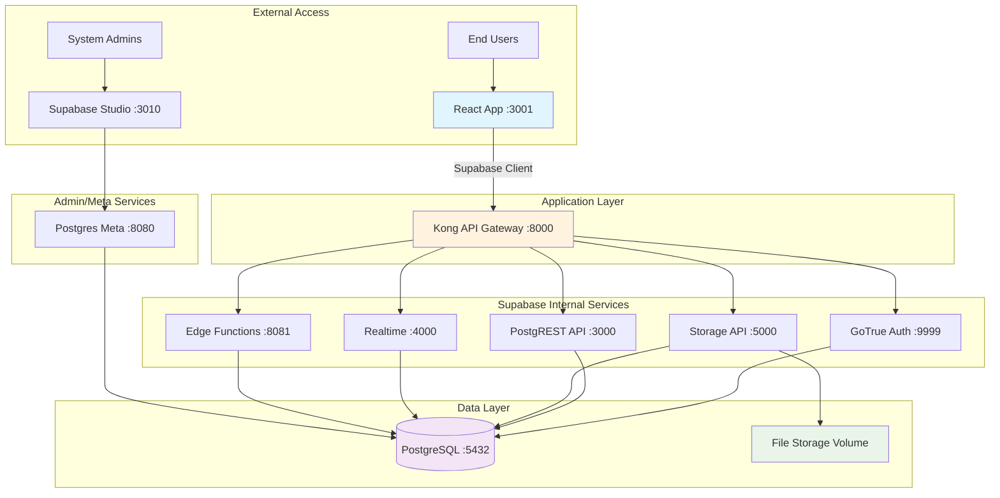
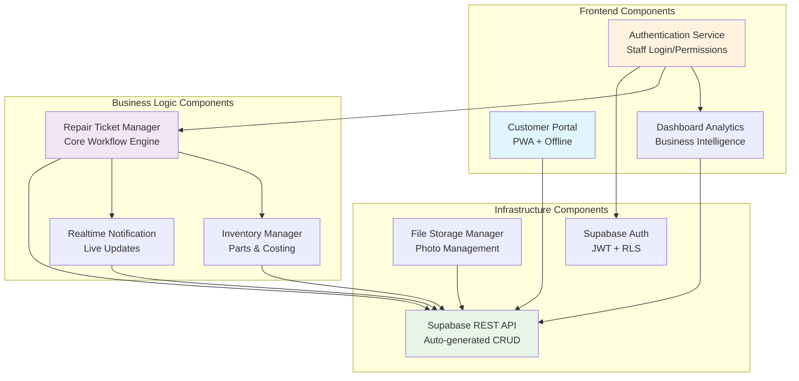
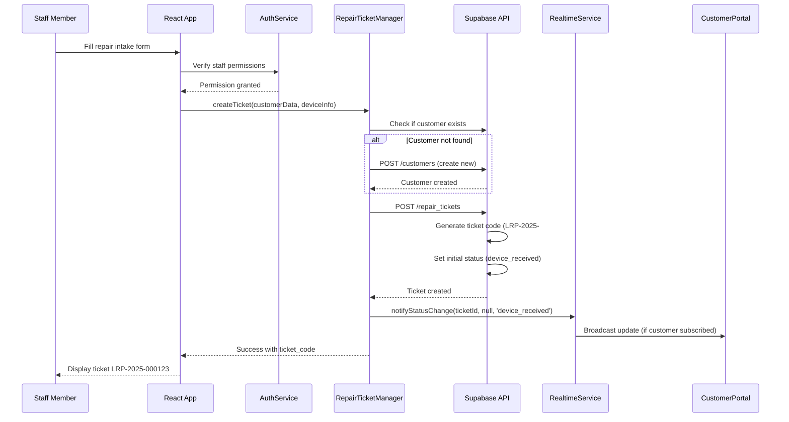
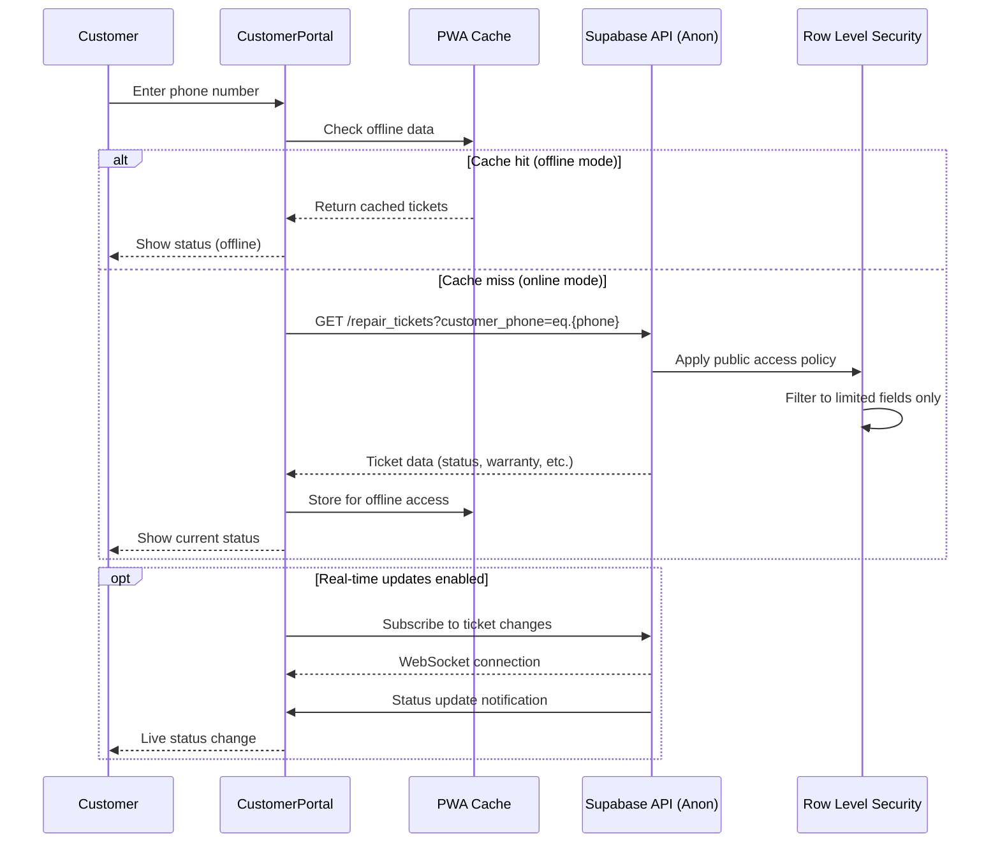
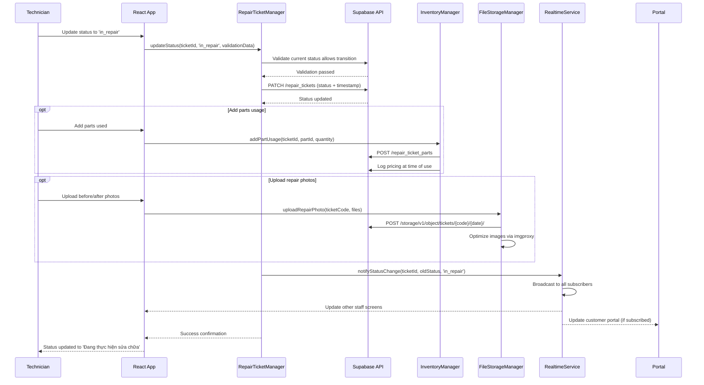

# Hệ thống Quản lý Sửa chữa Laptop Fullstack Architecture Document

## Introduction

This document outlines the complete fullstack architecture for **Hệ thống Quản lý Sửa chữa Laptop** (Vietnamese Laptop Repair Management System), including backend systems, frontend implementation, and their integration. It serves as the single source of truth for AI-driven development, ensuring consistency across the entire technology stack.

This unified approach combines what would traditionally be separate backend and frontend architecture documents, streamlining the development process for modern fullstack applications where these concerns are increasingly intertwined.

The system serves a small laptop repair shop (<10 employees) transitioning from WordPress to a comprehensive management platform handling repair workflows, customer management, parts inventory, and public repair ticket lookup.

### Starter Template Analysis

**Template Assessment:** Your project uses a **self-hosted Supabase stack** via Docker rather than standard starter templates. Key architectural constraints already established:

- **Backend:** Self-hosted Supabase via Docker (PostgreSQL, Auth, Storage, Real-time, RLS)
- **Frontend:** Vite + React 19 + TanStack Router + TypeScript
- **Infrastructure:** All-in-one Docker Compose with **Supabase's internal Kong API gateway**
- **Deployment Model:** Single environment (no dev/prod separation)
- **Environment Setup:** 3-phase approach (make env → make init → make data)

### CRITICAL Kong Architecture Understanding

**Kong is Supabase's INTERNAL API Gateway** - Kong aggregates ALL Supabase services (auth, rest, storage, realtime, functions) through a single endpoint (localhost:8000).

**Connection Flow:**
```
React App → Supabase Client → Kong (localhost:8000) → Internal Supabase Services
                                    ├── Auth Service (:9999)
                                    ├── PostgREST API (:3000)
                                    ├── Storage Service (:5000)
                                    ├── Realtime Service (:4000)
                                    └── Edge Functions (:8081)
```

**Only 3 services exposed externally:**
- **Port 3001:** React Application (for end users)
- **Port 8000/8443:** Kong/Supabase API (for React app via Supabase client)
- **Port 3010:** Studio (for database management)

**The React app runs independently** and connects ONLY to Kong endpoint, never directly to individual Supabase services.

### Change Log

| Date | Version | Description | Author |
|------|---------|-------------|--------|
| 2025-01-22 | 1.0 | Initial architecture document | Winston (Architect Agent) |

## High Level Architecture

### Technical Summary

This Vietnamese laptop repair management system implements a **self-hosted Supabase + React 19 monolithic architecture** optimized for small business operations. The system uses Docker Compose to orchestrate a complete Supabase backend stack (PostgreSQL with RLS, GoTrue auth, real-time subscriptions, file storage) behind Kong's internal API gateway, paired with a modern React 19 frontend using TanStack Router for sophisticated client-side routing. The architecture prioritizes **operational simplicity** through single-environment deployment while maintaining enterprise-grade features like real-time repair status updates, role-based access control, and PWA capabilities for offline customer portal access. This approach eliminates traditional dev/ops complexity while providing the scalability and security needed for a growing repair business.

### Platform and Infrastructure Choice

**Platform:** Self-hosted Docker Compose on single server/VPS
**Key Services:** Supabase stack (PostgreSQL, GoTrue, PostgREST, Realtime, Storage, Kong), React 19 with Vite
**Deployment Host and Regions:** Single deployment region (customer's preferred hosting location)

### Repository Structure

**Structure:** Monorepo with separated frontend/backend concerns
**Monorepo Tool:** pnpm workspaces (lightweight, fast)
**Package Organization:** Clear separation between React app, Supabase configuration, and shared types/utilities

### High Level Architecture Diagram



### Architectural Patterns

- **Self-hosted Supabase Architecture:** Complete backend-as-a-service running in controlled environment - _Rationale:_ Provides enterprise features (RLS, real-time, auth) without vendor lock-in or recurring cloud costs
- **Component-Based React UI:** Modern React 19 with shadcn/ui components and TypeScript - _Rationale:_ Maintainable, type-safe frontend with excellent developer experience and Vietnamese localization support
- **API Gateway Pattern:** Kong consolidates all backend services through single endpoint - _Rationale:_ Simplifies client configuration and provides centralized auth/routing for Supabase services
- **Progressive Web App (PWA):** Offline-capable public pages with online-only authenticated sections - _Rationale:_ Customers can check repair status offline while staff operations require real-time data
- **Row Level Security (RLS):** Database-level access control for multi-tenant data isolation - _Rationale:_ Ensures customers only see their repair data while staff see appropriate subsets based on roles
- **File-based Routing:** TanStack Router with automatic route generation - _Rationale:_ Scales well with Vietnamese URL structure (/sua-laptop, /phieu-sua-chua) and provides type-safe navigation

## Tech Stack

### Technology Stack Table

| Category | Technology | Version | Purpose | Rationale |
|----------|------------|---------|---------|-----------|
| Frontend Language | TypeScript | 5.0+ | Type-safe JavaScript development | Essential for large codebase maintainability and Vietnamese language handling |
| Frontend Framework | React | 19.0+ | Component-based UI framework | Latest React with concurrent features, excellent ecosystem for repair shop workflows |
| Frontend Build Tool | Vite | 5.0+ | Fast development server and bundler | Superior hot reload performance, optimized for React 19 development |
| UI Component Library | shadcn/ui | Latest | Pre-built accessible components | Consistent Vietnamese-friendly design system with Tailwind integration |
| CSS Framework | Tailwind CSS | 4.0+ | Utility-first styling | Rapid UI development with excellent mobile responsiveness for repair workflows |
| Frontend Router | TanStack Router | 1.0+ | Type-safe client-side routing | File-based routing perfect for Vietnamese URL structure (/sua-laptop, /khach-hang) |
| State Management | React Built-in | React 19 | useState/useReducer/Context | Simple state needs, avoid over-engineering for small repair shop scope |
| Backend Platform | Supabase (Self-hosted) | Latest | Complete backend-as-a-service | PostgreSQL + Auth + Storage + Realtime + RLS in Docker container |
| Database | PostgreSQL | 15.8+ | Primary data store | ACID compliance for repair records, excellent JSON support, integrated with Supabase |
| API Style | Supabase Auto-generated REST | PostgREST | Database-to-API conversion | Automatic API generation from PostgreSQL schema with RLS integration |
| Authentication | Supabase Auth (GoTrue) | 2.177+ | User authentication and authorization | JWT-based auth with row-level security, perfect for staff/customer separation |
| File Storage | Supabase Storage | 1.25+ | Repair photos and documents | S3-compatible API with image transformation via imgproxy |
| Real-time | Supabase Realtime | 2.34+ | Live repair status updates | WebSocket connections for real-time repair progress notifications |
| API Gateway | Kong (Supabase Internal) | 2.8.1 | Service mesh for Supabase | Consolidates all Supabase services through single endpoint |
| Frontend Testing | Vitest | Latest | Unit and integration testing | Vite-native testing, fast execution for React components |
| E2E Testing | Playwright | Latest | End-to-end workflow testing | Cross-browser testing for repair ticket workflows and customer portal |
| Package Manager | pnpm | 8.0+ | Fast, efficient dependency management | Disk space efficient, excellent monorepo support |
| Linting/Formatting | Biome | Latest | Code quality and formatting | All-in-one tool replacing ESLint + Prettier with better performance |
| Container Platform | Docker Compose | Latest | Service orchestration | Single-file deployment for all Supabase services |
| Environment Setup | Make | System | Build automation | Simple command interface (make env, make init, make data) |
| Development Server | Vite Dev Server | 5.0+ | Hot module replacement | Fast refresh for React 19 development |
| PWA Support | Vite PWA Plugin | Latest | Progressive web app capabilities | Offline customer portal for repair status lookup |
| Image Processing | imgproxy (via Supabase) | 3.8+ | Repair photo optimization | Automatic image resizing and format conversion |
| Database UI | Supabase Studio | Latest | Database administration | Web-based PostgreSQL management interface |

## Data Models

### RepairTicket

**Purpose:** Central entity representing a laptop repair request from initial intake through completion, with comprehensive status tracking and payment management.

**Key Attributes:**
- `ticket_code`: string - Unique identifier (LRP-YYYY-###### format)
- `customer_phone`: string - Primary key reference to customer (Vietnamese phone format)
- `device_info`: object - Laptop model, serial number, initial condition
- `issue_description`: string - Customer-reported problem description
- `status`: enum - Current repair stage (16 possible states from project brief)
- `assigned_technician_id`: uuid - Staff member responsible for repair
- `created_at`: timestamp - Initial ticket creation
- `estimated_completion`: timestamp - Projected completion date
- `total_cost`: decimal - Final repair price
- `deposit_amount`: decimal - Upfront payment received
- `is_paid`: boolean - Payment completion status
- `warranty_until`: date - Warranty expiration date

#### TypeScript Interface
```typescript
interface RepairTicket {
  id: string;
  ticket_code: string; // LRP-2025-000123
  customer_phone: string;
  device_info: {
    brand: string;
    model: string;
    serial_number?: string;
    initial_condition: string;
  };
  issue_description: string;
  status: RepairStatus;
  assigned_technician_id?: string;
  created_at: string;
  updated_at: string;
  estimated_completion?: string;
  total_cost?: number;
  deposit_amount?: number;
  is_paid: boolean;
  paid_at?: string;
  payment_method?: 'cash' | 'transfer' | 'other';
  warranty_until?: string;
  // Validation fields for status transitions
  has_issue_report: boolean;
  customer_approved_at?: string;
  repair_completed_at?: string;
}

type RepairStatus =
  | 'device_received' | 'preliminary_inspection' | 'awaiting_repair_plan'
  | 'approved_for_repair' | 'in_diagnosis' | 'waiting_parts' | 'in_repair'
  | 'quality_testing' | 'ready_for_pickup' | 'completed'
  | 'cannot_repair' | 'cancelled_by_customer' | 'repair_failed'
  | 'customer_no_show' | 'ready_for_return' | 'abandoned';
```

#### Relationships
- Belongs to one Customer (via customer_phone)
- Has many RepairTicketParts (parts used)
- Has many RepairTicketPhotos (before/after images)
- Has many InternalComments (staff notes)
- Assigned to one UserProfile (technician)

### Customer

**Purpose:** Represents repair service customers with phone number as primary identifier, supporting the Vietnamese business model where customers don't need accounts.

**Key Attributes:**
- `phone`: string - Primary key (Vietnamese phone number format)
- `full_name`: string - Customer's full name
- `address`: text - Physical address for device pickup/delivery
- `notes`: text - Internal staff notes about customer preferences/history
- `created_at`: timestamp - First interaction date
- `total_repairs`: integer - Count of completed repairs (computed)

#### TypeScript Interface
```typescript
interface Customer {
  phone: string; // Primary key
  full_name: string;
  address?: string;
  notes?: string;
  created_at: string;
  updated_at: string;
  total_repairs?: number; // Computed field
}
```

#### Relationships
- Has many RepairTickets
- No authentication (customers access via phone lookup only)

### UserProfile

**Purpose:** Staff members who use the authenticated system, with role-based permissions for repair shop operations.

**Key Attributes:**
- `id`: uuid - Primary key (linked to Supabase auth)
- `email`: string - Login credential
- `full_name`: string - Staff member name
- `role`: enum - Permission level (shop_owner, manager, technician, staff)
- `is_active`: boolean - Employment status
- `can_create_users`: boolean - Admin permissions
- `can_manage_inventory`: boolean - Parts management access
- `phone`: string - Staff contact number

#### TypeScript Interface
```typescript
interface UserProfile {
  id: string; // UUID from Supabase auth
  email: string;
  full_name: string;
  role: 'shop_owner' | 'manager' | 'technician' | 'staff';
  is_active: boolean;
  can_create_users: boolean;
  can_manage_inventory: boolean;
  can_view_financials: boolean;
  can_delete_repairs: boolean;
  phone?: string;
  created_at: string;
  updated_at: string;
}
```

#### Relationships
- Linked to Supabase Auth user
- Has many assigned RepairTickets
- Can create InternalComments

### Part

**Purpose:** Inventory items used in laptop repairs, with simple stock tracking and pricing history.

**Key Attributes:**
- `id`: uuid - Primary key
- `name`: string - Part description
- `category`: string - Classification (screen, keyboard, battery, etc.)
- `brand`: string - Manufacturer
- `model_compatibility`: array - Compatible laptop models
- `current_stock`: integer - Available quantity (simplified tracking)
- `unit_cost`: decimal - Purchase price
- `unit_price`: decimal - Sale price to customers
- `supplier_info`: text - Vendor contact information

#### TypeScript Interface
```typescript
interface Part {
  id: string;
  name: string;
  category: string;
  brand?: string;
  model_compatibility: string[];
  current_stock: number;
  unit_cost: number;
  unit_price: number;
  supplier_info?: string;
  created_at: string;
  updated_at: string;
}
```

#### Relationships
- Used in many RepairTicketParts (usage log)
- Belongs to PartCategory (classification)

### RepairTicketPart

**Purpose:** Junction table logging parts used in specific repairs, preserving pricing at time of use for accurate cost tracking.

**Key Attributes:**
- `ticket_id`: uuid - Reference to repair ticket
- `part_id`: uuid - Reference to part used
- `quantity`: integer - Amount used
- `unit_cost_at_use`: decimal - Purchase price when used
- `unit_price_at_use`: decimal - Sale price when used
- `warranty_months`: integer - Part-specific warranty period
- `notes`: text - Installation notes

#### TypeScript Interface
```typescript
interface RepairTicketPart {
  id: string;
  ticket_id: string;
  part_id: string;
  quantity: number;
  unit_cost_at_use: number;
  unit_price_at_use: number;
  warranty_months?: number;
  notes?: string;
  used_at: string;
}
```

#### Relationships
- Belongs to RepairTicket
- References Part (for current info)
- Preserves historical pricing data

## API Specification

### Supabase Auto-generated REST API

**API Base URL:** `http://localhost:8000/rest/v1/` (via Kong)
**Authentication:** Bearer JWT tokens (anon key for public access, user JWT for authenticated)
**Content-Type:** `application/json`

#### Core API Endpoints

**Repair Tickets Management:**
```yaml
# Get all repair tickets (staff only, with RLS filtering)
GET /rest/v1/repair_tickets
Authorization: Bearer {user_jwt}

# Create new repair ticket
POST /rest/v1/repair_tickets
Authorization: Bearer {user_jwt}
Content-Type: application/json
{
  "customer_phone": "+84901234567",
  "device_info": {
    "brand": "Dell",
    "model": "Inspiron 15 3000",
    "initial_condition": "Màn hình bị vỡ"
  },
  "issue_description": "Màn hình laptop bị vỡ sau khi rơi"
}

# Update repair status
PATCH /rest/v1/repair_tickets?id=eq.{ticket_id}
Authorization: Bearer {user_jwt}
{
  "status": "in_repair",
  "assigned_technician_id": "{technician_uuid}"
}

# Public ticket lookup (no auth required)
GET /rest/v1/repair_tickets?customer_phone=eq.{phone}&select=ticket_code,status,device_info,created_at,warranty_until
Authorization: Bearer {anon_key}
```

**Customer Management:**
```yaml
# Get customer details (staff only)
GET /rest/v1/customers?phone=eq.{phone}
Authorization: Bearer {user_jwt}

# Create customer (auto-created on first ticket)
POST /rest/v1/customers
Authorization: Bearer {user_jwt}
{
  "phone": "+84901234567",
  "full_name": "Nguyễn Văn An",
  "address": "123 Đường ABC, Quận 1, TP.HCM"
}
```

**File Upload (Repair Photos):**
```yaml
# Upload repair photos
POST /storage/v1/object/tickets/{ticket_code}/{date}/photo.jpg
Authorization: Bearer {user_jwt}
Content-Type: image/jpeg

# Get signed URL for photo
POST /storage/v1/object/sign/tickets/{ticket_code}/{date}/photo.jpg
Authorization: Bearer {user_jwt}
{
  "expiresIn": 3600
}
```

**Real-time Subscriptions:**
```yaml
# Subscribe to repair ticket updates
WebSocket: ws://localhost:8000/realtime/v1/websocket
{
  "topic": "realtime:public:repair_tickets",
  "event": "phx_join",
  "payload": {
    "config": {
      "postgres_changes": [
        {
          "event": "UPDATE",
          "schema": "public",
          "table": "repair_tickets",
          "filter": "customer_phone=eq.{phone}"
        }
      ]
    }
  }
}
```

#### Row Level Security (RLS) Policies

**Public Access (Anon Key):**
- `repair_tickets`: Read-only, limited fields (ticket_code, status, warranty_until)
- `customers`: No access

**Staff Access (User JWT):**
- `repair_tickets`: Full CRUD based on role permissions
- `customers`: Read all, create/update based on role
- `parts`: Read all, update if `can_manage_inventory = true`
- `user_profiles`: Read all active users

**Data Isolation:**
- Customers only see their own tickets via phone lookup
- Staff see tickets based on assignment and role permissions
- Admin sees all data without restrictions

## Components

### AuthenticationService

**Responsibility:** Manages user authentication, session handling, and role-based access control for staff members using Supabase Auth.

**Key Interfaces:**
- `signIn(email, password)` - Staff login
- `signOut()` - Session termination
- `getCurrentUser()` - Get authenticated user profile
- `checkPermissions(action, resource)` - Role-based access validation

**Dependencies:** Supabase Auth, UserProfile data model

**Technology Stack:** Supabase GoTrue, React Context, TypeScript interfaces

### RepairTicketManager

**Responsibility:** Core business logic for repair ticket lifecycle management, status transitions, and workflow validation.

**Key Interfaces:**
- `createTicket(customerData, deviceInfo)` - New repair intake
- `updateStatus(ticketId, newStatus, validationData)` - Status progression
- `assignTechnician(ticketId, technicianId)` - Task assignment
- `validateStatusTransition(current, target, ticket)` - Business rule validation
- `generateTicketCode(year)` - Sequential ticket numbering

**Dependencies:** RepairTicket, Customer, UserProfile models; Supabase database

**Technology Stack:** PostgreSQL functions, Supabase PostgREST, TypeScript validation

### CustomerPortal

**Responsibility:** Public-facing interface for customers to lookup repair status without authentication, optimized for mobile and offline use.

**Key Interfaces:**
- `lookupTickets(phoneNumber)` - Phone-based ticket search
- `getTicketStatus(ticketCode)` - Individual ticket details
- `getWarrantyInfo(ticketCode)` - Warranty status lookup
- `enableOfflineAccess()` - PWA offline functionality

**Dependencies:** Supabase anon key access, RepairTicket model (limited fields)

**Technology Stack:** React 19 PWA, TanStack Router, Service Worker, Cache API

### FileStorageManager

**Responsibility:** Handles repair photo uploads, image optimization, and secure file access with automatic organization by ticket and date.

**Key Interfaces:**
- `uploadRepairPhoto(ticketCode, file, category)` - Photo upload with metadata
- `getSignedUrl(filePath, expiresIn)` - Secure file access
- `optimizeImage(file, options)` - Automatic resize/compression
- `organizeByTicket(ticketCode, date)` - File system organization

**Dependencies:** Supabase Storage, imgproxy service, RepairTicket model

**Technology Stack:** Supabase Storage API, imgproxy, React file upload, image processing

### RealtimeNotificationService

**Responsibility:** Provides live updates for repair status changes, enabling real-time communication between staff and automatic customer notifications.

**Key Interfaces:**
- `subscribeToTicketUpdates(ticketId, callback)` - Real-time status monitoring
- `notifyStatusChange(ticketId, oldStatus, newStatus)` - Status broadcast
- `manageSubscriptions(userId, permissions)` - Role-based subscription filtering
- `handleConnectionState()` - WebSocket connection management

**Dependencies:** Supabase Realtime, RepairTicket model, UserProfile permissions

**Technology Stack:** Supabase Realtime WebSockets, React hooks, TypeScript event handling

### InventoryManager

**Responsibility:** Parts inventory tracking, usage logging, and cost calculation for repair tickets with simplified stock management.

**Key Interfaces:**
- `addPartUsage(ticketId, partId, quantity, pricing)` - Log part consumption
- `checkStockAvailability(partId, quantity)` - Stock validation
- `calculateTicketCosts(ticketId)` - Total cost computation
- `preservePricingHistory(partUsage)` - Historical cost tracking

**Dependencies:** Part, RepairTicketPart models, UserProfile permissions

**Technology Stack:** PostgreSQL calculations, Supabase functions, TypeScript business logic

### DashboardAnalytics

**Responsibility:** Business intelligence and reporting for repair shop operations, with role-based data access and Vietnamese business metrics.

**Key Interfaces:**
- `getDashboardStats(userId, dateRange)` - Key performance indicators
- `getRepairMetrics(period)` - Repair volume and timing analysis
- `getRevenueReport(period, permissions)` - Financial summaries
- `getTechnicianPerformance(period)` - Staff productivity metrics

**Dependencies:** All data models, UserProfile permissions, date range filtering

**Technology Stack:** PostgreSQL aggregations, Supabase views, React visualization components

### Component Interaction Diagram



## Core Workflows

### Workflow 1: New Repair Ticket Creation



### Workflow 2: Customer Ticket Lookup (Public)



### Workflow 3: Repair Status Progression


